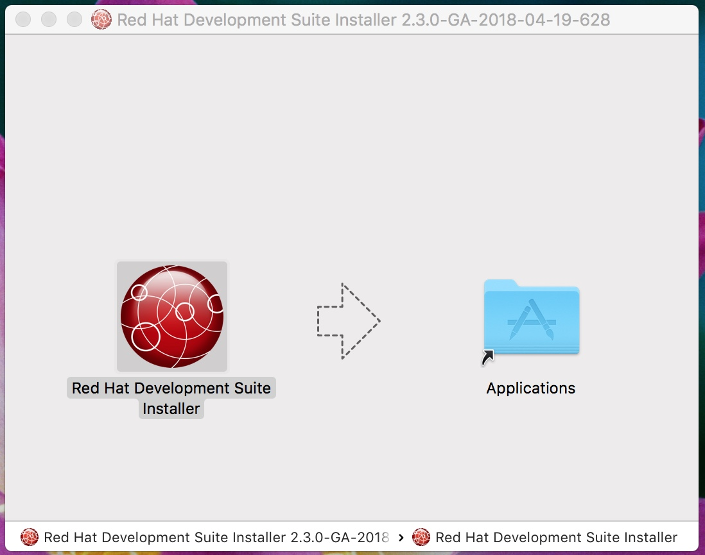
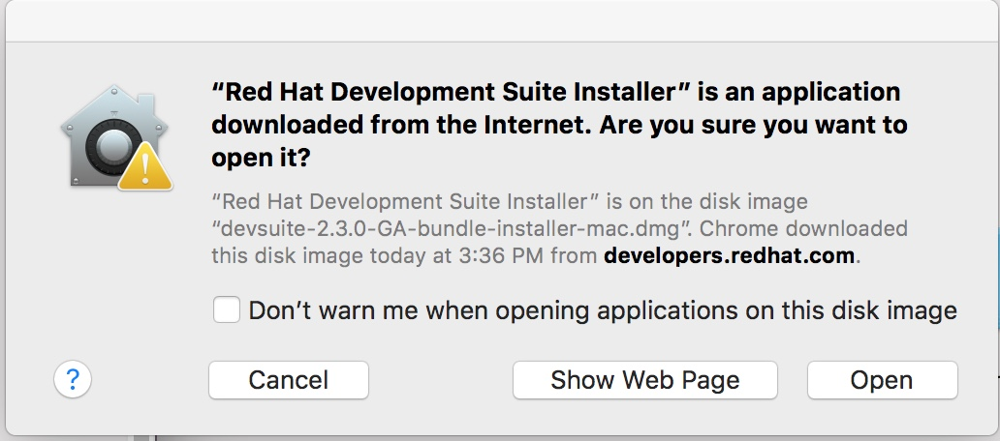
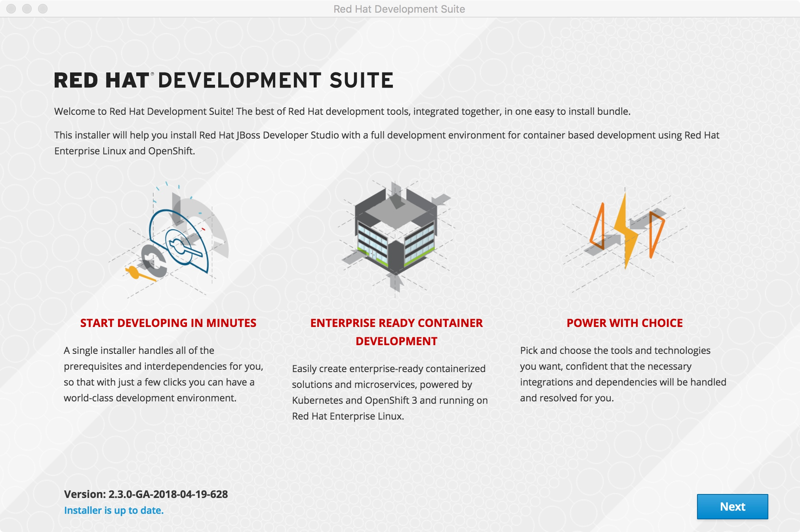
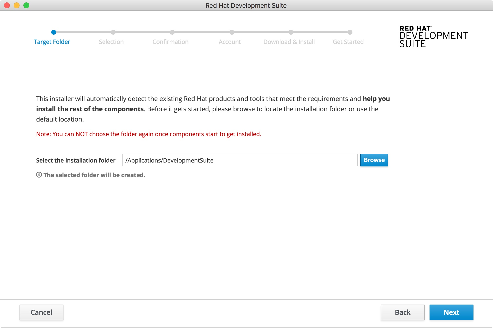
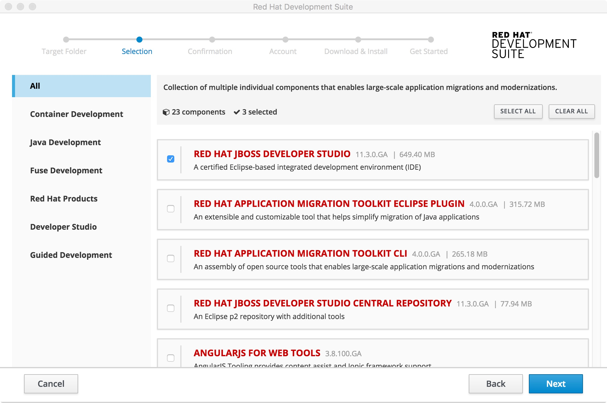
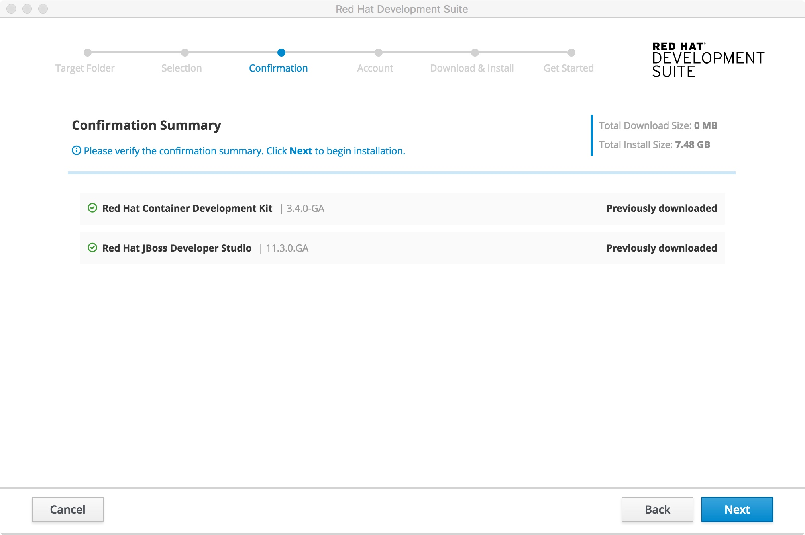
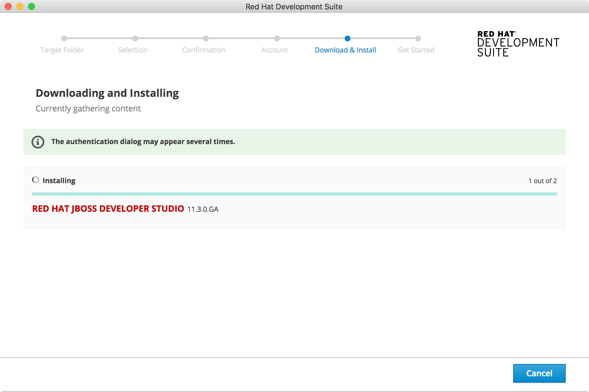
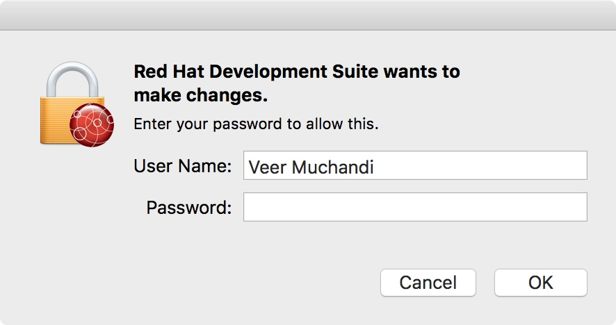
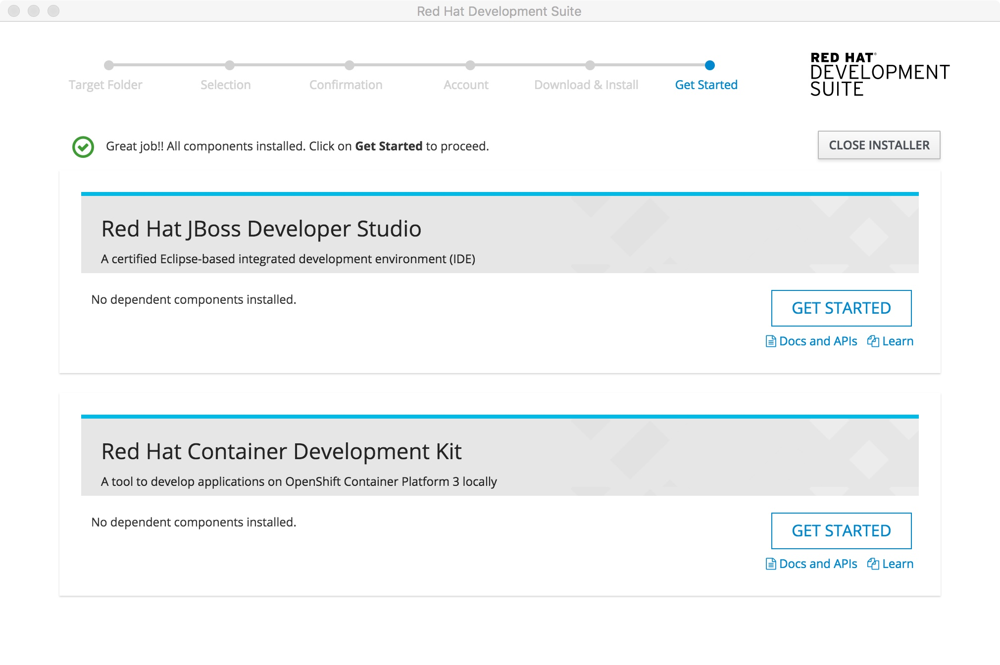

## Lab 1: Setup Red Hat Development Suite

In this lab we will install Red Hat Development Suite that includes Red Hat OpenShift Container Development Kit (CDK), and JBoss Developer Studio.

### Pre-requisites

Please read the pre-requisites for this workshop. If you cannot meet these pre-requisites you may not be successful in this workshop. So let your instructor know.

* You will need a computer where you can install [Red Hat Development Suite](https://developers.redhat.com/products/devsuite/overview/). So please make sure you have rights to install software on your device.

* Red Hat Development Suite 2.3 is supported on the following platforms. So your device must be one of these:
	* Windows 7, 8, and 10
	* macOS 10.9 or newer
	* Red Hat Enterprise Linux 7

* Red Hat Development Suite 2.3 spins up a virtual machine on your box. Supported hypervisors are
	* Windows: Hyper-V, VirtualBox 5.2.8
	* macOS: VirtualBox 5.2.8, Xhyve
	* Red Hat Enterprise Linux: KVM
The experience will be better and faster if you have VirtualBox or other supported hypervisor pre-installed.

Ensure Virtualization is enabled on your machine.

**If macOS:** In a terminal, run the sysctl -a | grep machdep.cpu.features command. The result will be a string of features. If the output includes VMX, the machine has Virtualization enabled. If not enabled see your system’s documentation for instruction.

**If Windows:** Ensure that Virtualization is enabled in your machine’s BIOS settings. If Red Hat Development Suite is run on a new system, ensure that Virtualization is enabled in the BIOS settings. This is required to run VirtualBox. See your system’s documentation for instructions to change BIOS settings.

* Recommended system requirements for Red Hat Development Suite are:
	* 16 GB RAM
	* 47 GB disk space
	* CPU Intel i5 2GHz or better

* Ensure that Java SE 1.8.0 is installed:
If macOS: Download and install Java SE 1.8.0 Build 111 from the Oracle website: Java Download.

* Ensure Maven 3.5 or above is installed.

### Register with Red Hat
In order to use Red Hat Development Suite, you need an account with [developers.redhat.com](http://developers.redhat.com)

Please navigate to the link from your browser, use `Register` link on the top right to register yourself, if you haven't done so.

Note your credentials (`username` and `password`) as you will need them later.

### Copy the installers from flash drive

*  Copy contents from the flash drive to your local machine
*  Navigate to `DevSuiteInstaller` folder. This folder has bundled installers for MacOS and Windows.
	* Mac installer is named `devsuite-2.3.0-GA-bundle-installer-mac.dmg`
	* Windows installer is named `devsuite-2.3.0-GA-bundle-installer.exe`


### Install Development Suite: 

------------


**On Mac:**	

Double click on the installer file named `devsuite-2.3.0-GA-bundle-installer-mac.dmg`

It will open up the installer window. Double click on the `Red Hat Developer Suite Installer` icon (the Red Sphere)



The installer will warn you about the content. Click on `Open` button to move forward.




**On Windows:**

Double click on the installer file named `devsuite-2.3.0-GA-bundle-installer.exe`

Click `Yes` when it asks "Do you want to allow this app to make changes to your device?`

** On RHEL:**

Make sure you're subscribed to the proper channels

```
subscription-manager repos --disable=*
subscription-manager repos --enable=rhel-7-server-rpms \
--enable rhel-7-server-devtools-rpms \
--enable rhel-server-rhscl-7-rpms \
--enable rhel-7-server-extras-rpms \
--enable rhel-7-server-optional-rpms
```

Next, add the Red Hat Developer Tools key to your system

```
cd /etc/pki/rpm-gpg
wget -O RPM-GPG-KEY-redhat-devel https://www.redhat.com/security/data/a5787476.txt
rpm --import RPM-GPG-KEY-redhat-devel
```

Now you can install the developer suite

```
yum -y install rh-devsuite rh-eclipse47-devstudio
```

-------------


Click `Next` button to move forward on the next screen



Select an installation target folder by clicking on `Browse` or if you are happy with the default location simply press on `Next` and move ahead. **Note** on windows this default location shows up as `C:\Program Files\Development Suite`



Red Hat Development Suite installer can install a bunch of software for you. For the purpose of this workshop we are only interested in the following components:

- Red Hat JBoss Developer Studio
- Oracle Java (1.8) - if not already installed
- Red Hat Container Development Kit
- XHyve Hypervisor - if not already installed
- Cygwin (2.10.0) - on Windows

We had requested in the prerequisites for this lab that you will need a Java 1.8 and a Hypervisor. If you already have these components installed, they are auto detected by the installer. If not, the installer will add them for you.

Select above components in the `Selection` tab. If any other components are checked, you can uncheck them to get through the installation faster.




Look at the `Confirmation Summary` to make sure you have selected the right components to install and click `Next`. If the selects are not good, you can go back to the `Selection` tab by pressing `Back` button and change.
 


Now it's time to enter your Red Hat Developers Program credentials that you noted earlier. If you haven't registered yet, you have a chance to register now. Also choose `remember be` to let Developer Studio remember your credentials. Now press on `Download & Install` button.


The installation starts now. Since we have provided a bundled installer, nothing is downloaded from internet. 



The installer will expect you to have admin rights on the box. It will ask you for your credentials to be able to make changes to the device. Enter your administrative credentials for your workstation. 



Installer will run for a few mins. Once complete you'll see the success screen. Close the installer now.




Congratulations!! You have successfully installed Red Hat Development Suite on your workstation.

