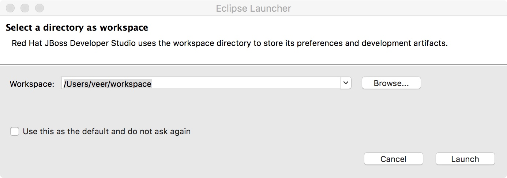
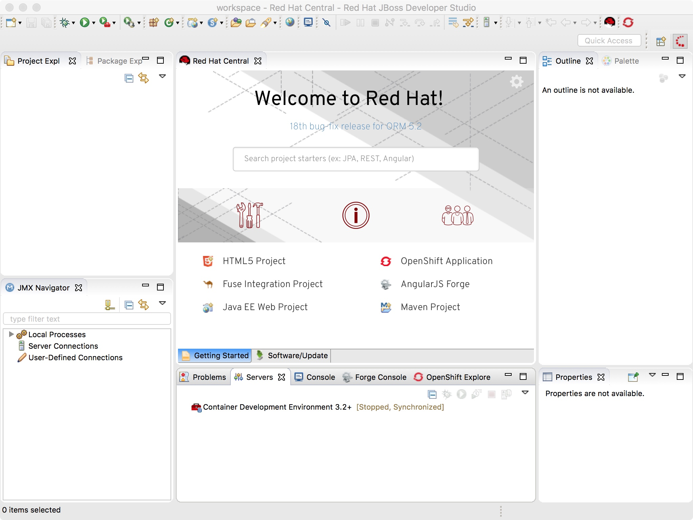
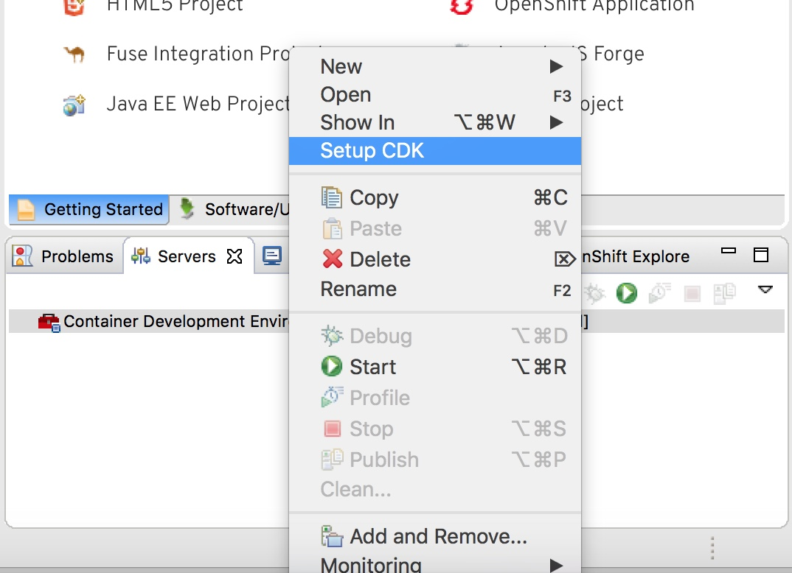
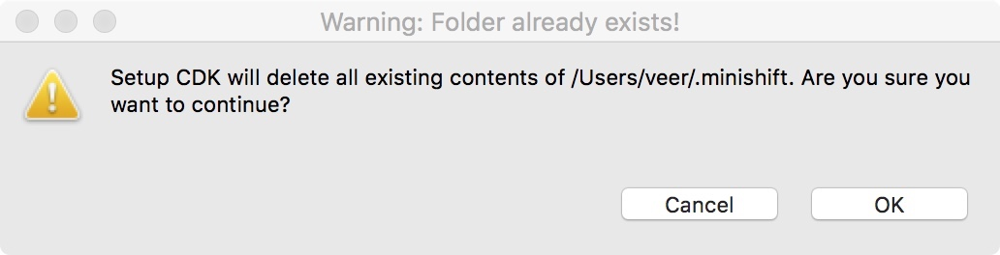
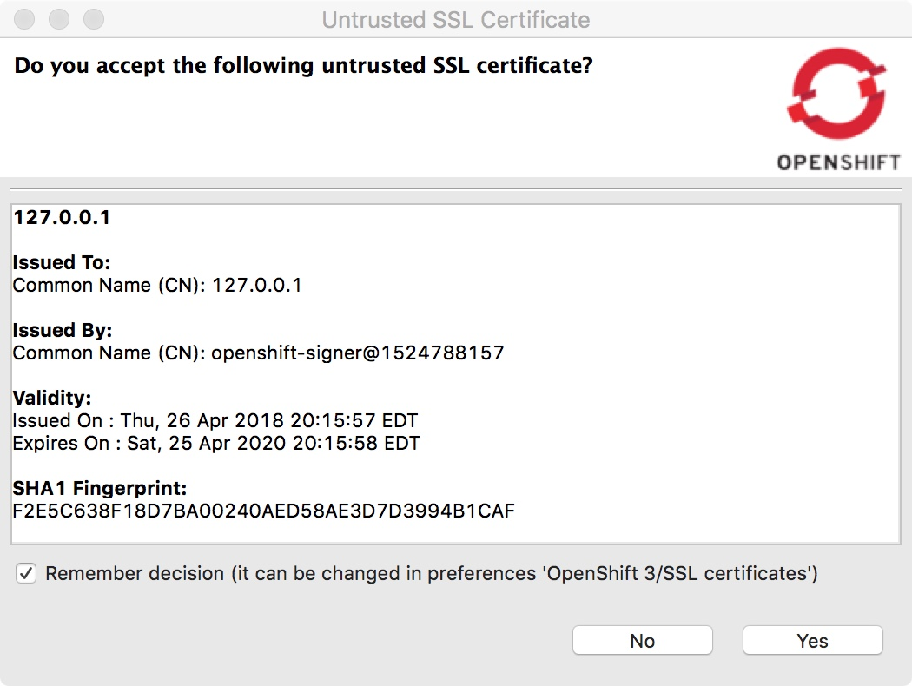
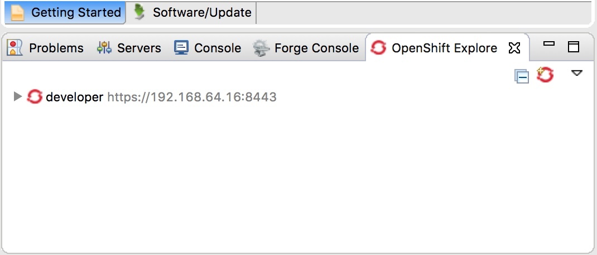
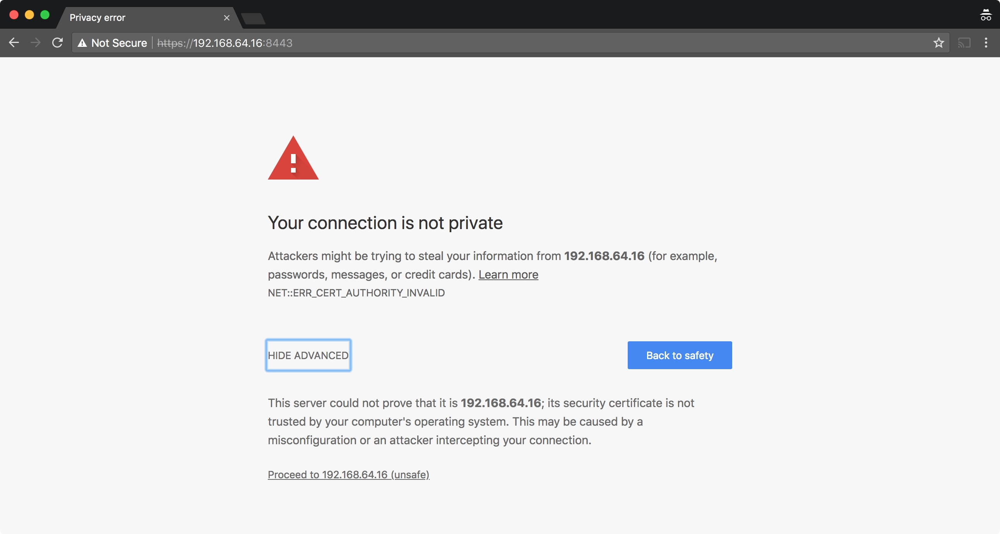
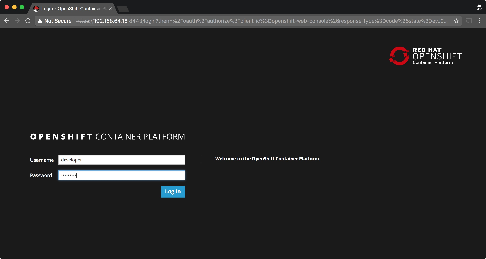
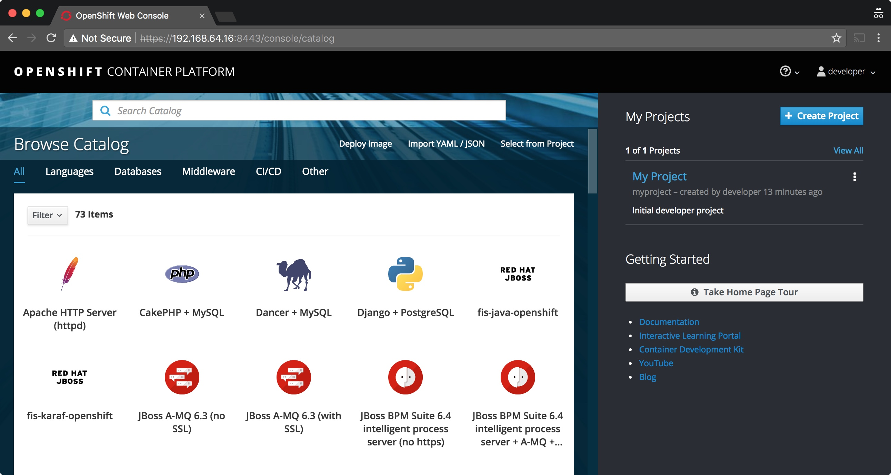

## Start JBoss Developer Studio and Setup CDK

In this lab, we will start JBDS and set up Red Hat Container Development Kit (CDK). 

**Red Hat® JBoss® Developer Studio** provides superior support for your entire development life cycle in one tool. It's a certified Eclipse-based integrated development environment (IDE) for developing, testing, and deploying rich web apps, mobile web apps, transactional enterprise apps, and microservices.

**Red Hat® Container Development Kit** provides a pre-built Container Development Environment based on Red Hat Enterprise Linux to help you develop container-based applications quickly. The containers you build can be easily deployed on any Red Hat container host or platform, including: Red Hat Enterprise Linux, Red Hat Enterprise Linux Atomic Host, and our platform-as-a-service solution, OpenShift Container Platform 3. This is Red Hat's supported version of the opensource [minishift](https://www.openshift.org/minishift/) project.


### Start JBDS

Start JBDS (Red Sphere Icon) from your application menu. The application starts up. It will prompt you to select a directory as workspace. You can `Browse` to change the location or just use the default.

**Note** If you have used JBDS or Eclipse before, you may want have conflict. You may have to clean up or use a different location.


JBDS comes up and you will see the following screen. Spend a couple of minutes to understand the layout.



Since we also installed CDK, you'll see `Container Development Environment 3.2+` in  `Servers` tab.

### Setup CDK

Navigate to Servers tab. Right click on `Container Development Environment 3.2+` to get the menu. Select `Setup CDK` here.


CDK setup task cleans up `.minishift` folder in your user home and recreates it. This will clean up any old data if you used minishift in the past. This `.minishift` hidden folder stores all the configuration information about your CDK set up on your work station.

You'll see a warning about cleaning up the contents. Click `OK`.




CDK runs OpenShift and other components as containers. We have pre-downloaded openshift images and provided the on the flash drive for you. This will save you on start up time in case internet is slow or in low network bandwidth situations. 

In order to use these pre-downloaded images let's run some commands from your terminal.


************************* 
**TBD**  Need to verify if CDK automatically adds minishift to executable path on the workstation in order to run the commands below.

**TBD** Verify or provide all the commands for Windows
**************************

Let us first run a command to check the images available to minishift

```
$ minishift images list
```
The output should be empty.

Now let's copy the images. Navigate to the folder you copied from flash drive to your workstation and execute this copy command to copy the `images` folder to `cache` folder in the `.minishift` folder. This will create an `images` folder and copy all its contents.

```
$ cp -R images ~/.minishift/cache
```

Now run check the images list again. This time it should display a bunch of images as shown below. If you did not copy these images, minishift/cdk will try to download them from Red Hat's registry on the fly and that may take a lot of time depending on the bandwidth. But if you are at home, you should be fine.

```
$ minishift images list
registry.access.redhat.com/openshift3/ose-deployer:v3.9.14
registry.access.redhat.com/openshift3/ose-docker-registry:v3.9.14
registry.access.redhat.com/openshift3/ose-haproxy-router:v3.9.14
registry.access.redhat.com/openshift3/ose-pod:v3.9.14
registry.access.redhat.com/openshift3/ose-web-console:v3.9.14
registry.access.redhat.com/openshift3/ose:v3.9.14
```

Next we will size the minishift VM in terms of CPU and Memory. The default allocation would be insufficient for our subsequent labs. So let us increase a little bit. 

**Note** You need enough capacity on your workstation to do this.

Let's set the memory to 8GB and CPUs to 2 cores for your virtual machine by running the following commands

```
$ minishift config set memory 8192
No Minishift instance exists. New 'memory' setting will be applied on next 'minishift start'

$ minishift config set cpu 2
Cannot find property name 'cpu'
```

As explained before the entire configuration of your CDK is saved inside `.minishift` folder. Verify your settings in the `.minishift/config/config.json` file.

```
$ cat ~/.minishift/config/config.json
{
    "addons": {
        "admin-user": {
            "Enabled": true,
            "Name": "admin-user",
            "Priority": 0
        },
        "anyuid": {
            "Enabled": true,
            "Name": "anyuid",
            "Priority": 0
        },
        "xpaas": {
            "Enabled": true,
            "Name": "xpaas",
            "Priority": 0
        }
    },
    "iso-url": "file:///Users/veer/.minishift/cache/iso/minishift-rhel7.iso",
    "memory": "8192",
    "vm-driver": "xhyve"
}

```

### Start CDK

Now it is time to start CDK. Go back to JBDS. Navigate to `Servers` tab. Right click on `Container Development Environment 3.2+` to get the menu. Select `Start` here.


Watch out for logs in the `Console` tab. It takes a couple of minutes to start up minishift/CDK. 

You should see logs as below: 

```
-- Starting profile 'minishift'
-- Checking if requested OpenShift version 'v3.9.14' is valid ... OK
-- Checking if requested OpenShift version 'v3.9.14' is supported ... OK
-- Checking if requested hypervisor 'xhyve' is supported on this platform ... OK
-- Checking if xhyve driver is installed ... 
   Driver is available at /usr/local/bin/docker-machine-driver-xhyve
   Checking for setuid bit ... OK
-- Checking the ISO URL ... OK
-- Checking if provided oc flags are supported ... OK
-- Starting local OpenShift cluster using 'xhyve' hypervisor ...
-- Minishift VM will be configured with ...
   Memory:    8 GB
   vCPUs :    2
   Disk size: 20 GB
-- Starting Minishift VM ................ OK
-- Registering machine using subscription-manager
   Registration in progress ............ OK [26s]
-- Checking for IP address ... OK
-- Checking for nameservers ... OK
-- Checking if external host is reachable from the Minishift VM ... 
   Pinging 8.8.8.8 ... OK
-- Checking HTTP connectivity from the VM ... 
   Retrieving http://minishift.io/index.html ... OK
-- Checking if persistent storage volume is mounted ... OK
-- Checking available disk space ... 1% used OK
   Importing 'registry.access.redhat.com/openshift3/ose:v3.9.14' .......... OK
   Importing 'registry.access.redhat.com/openshift3/ose-docker-registry:v3.9.14' .. OK
   Importing 'registry.access.redhat.com/openshift3/ose-haproxy-router:v3.9.14' ... OK
-- OpenShift cluster will be configured with ...
   Version: v3.9.14
Using nsenter mounter for OpenShift volumes
Using 192.168.64.16 as the server IP
Starting OpenShift using registry.access.redhat.com/openshift3/ose:v3.9.14 ...
OpenShift server started.

The server is accessible via web console at:
    https://192.168.64.16:8443

You are logged in as:
    User:     developer
    Password: <any value>

To login as administrator:
    oc login -u system:admin

-- Waiting for persistent volumes to be created ... OK

-- Applying addon 'admin-user':..
-- Applying addon 'anyuid':.
 Add-on 'anyuid' changed the default security context constraints to allow pods to run as any user.
 Per default OpenShift runs containers using an arbitrarily assigned user ID.
 Refer to https://docs.openshift.org/latest/architecture/additional_concepts/authorization.html#security-context-constraints and
 https://docs.openshift.org/latest/creating_images/guidelines.html#openshift-origin-specific-guidelines for more information.
-- Applying addon 'xpaas':....................................................................................................
XPaaS OpenShift imagestream and templates installed
See https://github.com/openshift/openshift-ansible/tree/master/roles/openshift_examples/files/examples/v3.7

```
While minishift comes up you'll be prompted to accepted untrusted certificate. Click `Yes` button.



**Note** from the above logs that minishift is configured with the sizes you configured

```
-- Minishift VM will be configured with ...
   Memory:    8 GB
   vCPUs :    2
   Disk size: 20 GB
```

**Note** from the above logs the following import steps are successful indicating that the images are imported from the cache instead of being downloaded via internet.

```
Importing 'registry.access.redhat.com/openshift3/ose:v3.9.14' .......... OK
   Importing 'registry.access.redhat.com/openshift3/ose-docker-registry:v3.9.14' .. OK
   Importing 'registry.access.redhat.com/openshift3/ose-haproxy-router:v3.9.14' ... OK
```

Also note the URL for the webconsole and the credentials to log into CDK. Once  minishift comes up you will be taken to `OpenShift Explorer` tab where you'll find a link to the OpenShift Cluster. Click in to navigate and see that there is a project named `My Project` created by default



### Access OpenShift Master

Type in the master URL, in my case it is https://192.168.64.16:8443, in your browser (Google Chrome preferred). 

You'll see a warning due to certificate. Click on `Advanced` and select `Proceed to 192.168.64.16(unsafe)`



You'll see login screen for OpenShift WebConsole. Type in `developer` as the username and any password. Click on `Log In` button.



You should now see OpenShift Catalog and a menu `My Project` under the list of project on the OpenShift Webconsole.



**Extra Credits:** Figure out how to stop CDK.


Congratulations!! You have started CDK and logged into OpenShift Webconsole provided by CDK.


