## Lab 5: Creating Wildfly Rest Services 

In this lab we will create 3 microservices. 

* Adjective microservice
* Noun Microservice
* Insult Microservice

Idea is to generate to random noun and an adjective to generate an insult. It is based on the following idea
http://www.literarygenius.info/a1-shakespearean-insults-generator.htm

### Prerequisites
* You should have CDK running
* Launchpad should have been installed on CDK
* JBoss Development Studio as IDE. You got this with JBoss Development Suite
* Apache Maven 3.5+


### Create Project Bundle with Fabric8 Launcher
* Start the Launcher, if you haven't already done so previously.
* Click on ‘Launch Your Project ‘
* Launcher will prompt you to login. You can type in your `developers.redhat.com` credentials to login.
* Select Deployment type  `I will build and run locally`
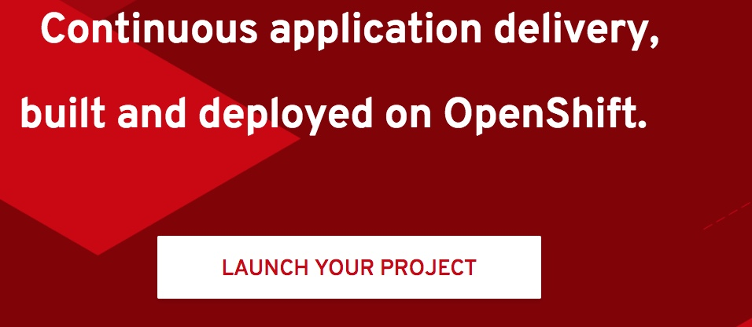
* Select mission `Rest API Level 0` can click `Next` to continue. Mission Control, as the name suggests, coordinates actions among dependent services. Its responsibility is to take the following inputs:
	* 	A GitHub Project
	* 	A GitHub project	
	* 	A GitHub user (via OAuth token)	
	* 	An OpenShift instance's API URL	
	* 	An OpenShift user (via OAuth token)	

	And performs the following actions:	
	
	* 	Fork the GitHub project into the GitHub user's namespace	
	* Create an OpenShift project	
	* Create a Jenkins Pipeline BuildConfig	
	* Associate the OpenShift project with the newly-forked GitHub repo	
	* Create a GitHub webhook on the newly-forked GitHub project to register push events to the OpenShift project	

* On the next screen select ‘Wildfly Swarm’ as the Runtime and hit ‘ Next’
	

* On the next screen add the following values for the parameters

	* Runtime Version: 2018.5.5
	* GroupId - io.openshift.booster
	* ArtifactId - wildflyswarm-adj
	* Version - 1.0.0-SNAPSHOT
	

**Note** Please use the above values as we'll be using then throught the lab.

* Review Summary on the next page and press on `Download as Zip File` button.

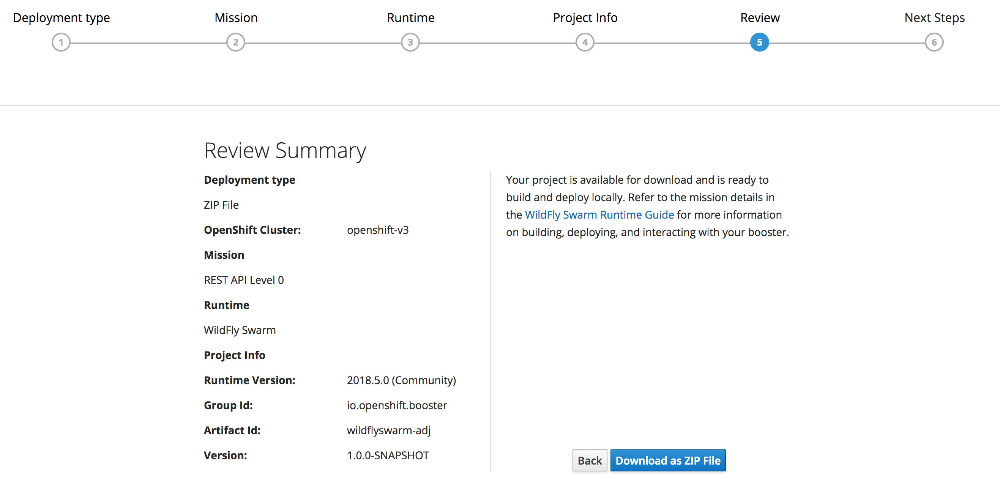	

Your application bundle will be downloaded as `wildflyswarm-adj.zip`.

* You should see the next step as shown below
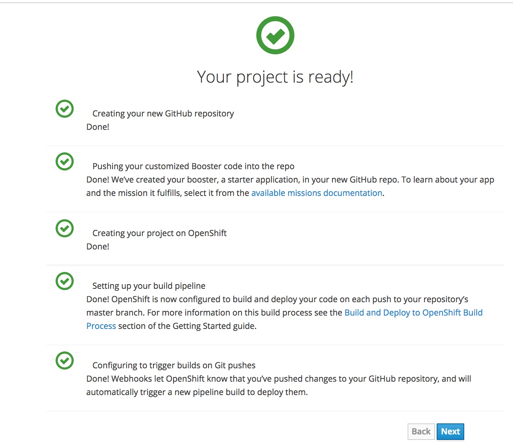	

### Import Project to JBoss Developer Studio

*  Run the following command to unzip the downloaded project bundle, or you can just double click

```
$ unzip wildflyswarm-adj.zip
```
Note the location of your unzipped file.

* Open JBoss Developer Studio (Redsphere Icon) 
* Choose the following menu options to import the project
`File` ->`Import`-> `Maven` ->`Existing Maven Projects` , `Browse` to the location where the unzipped project is and select the project. (Most likely you may have unzipped it in the `Downloads` folder!!)

* Explore the project i.e, expand `wildflyswarm-adj` project and look at `src/main/java` 

Explore the following auto-generated code (by the launcher):
* GreetingEndpoint.java

```
package io.openshift.booster;

import javax.ws.rs.GET;
import javax.ws.rs.Path;
import javax.ws.rs.Produces;
import javax.ws.rs.QueryParam;

@Path("/")
public class GreetingEndpoint {

    private static final String template = "Hello, %s!";

    @GET
    @Path("/greeting")
    @Produces("application/json")
    public Greeting greeting(@QueryParam("name") String name) {
        String suffix = name != null ? name : "World";
        return new Greeting(String.format(template, suffix));
    }
}

```

* ApplicationConfig is an auto generated class for Resource Entrypoint

```
package io.openshift.booster;

import javax.ws.rs.ApplicationPath;
import javax.ws.rs.core.Application;

/**
 * Resource entry point
 */
@ApplicationPath("/api")
public class ApplicationConfig extends Application {

}
```

Now, let us deploy this application to OpenShift and test it.

### Deploying Application into OpenShift

* Lets first create a project/namespace on openshift where will deploy wildfly swarm based apps. Open a terminal and run the following commands on CLI:

```
$ oc new-project wildflyswarmapps --display-name="wildflyswarmapps" --description="wildflyswarmapps"

```

Now lets deploy our new wildflyswarm-adj app from JBDS.

* Right click on the project `wildflyswarm-adj` ->`Run As` -> `Run Configurations`
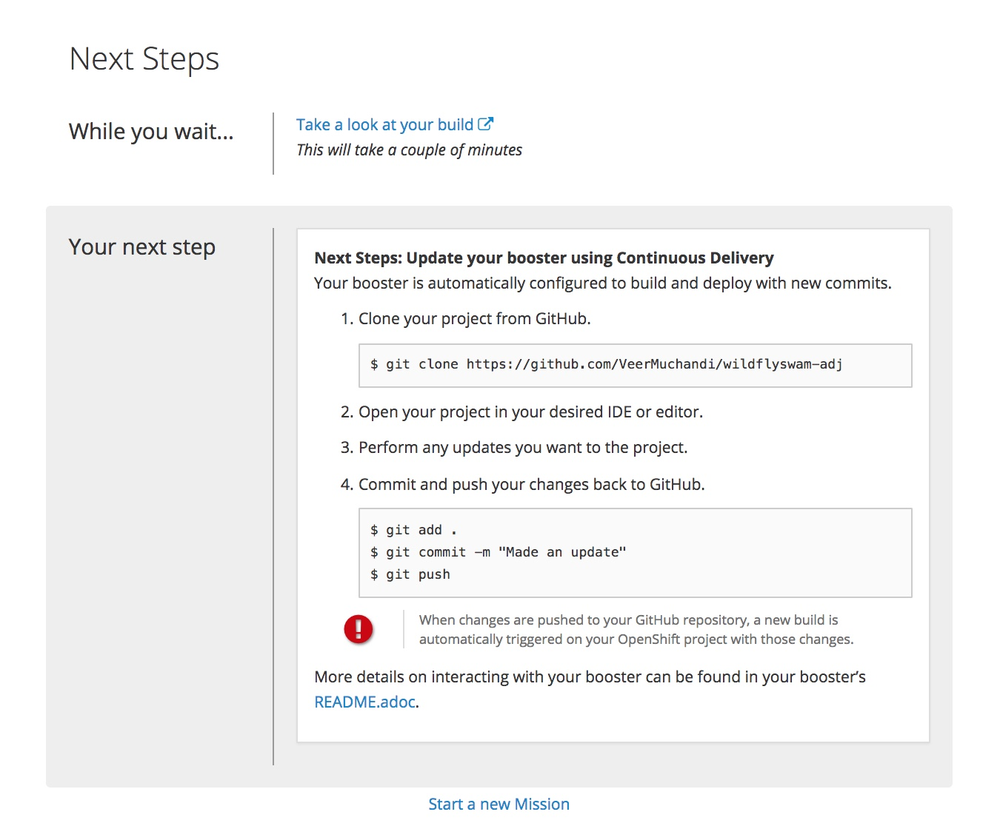	

* Then choose `Maven_Build` -> `New_Configuration` :

	* Name: `wildflyswarm-adj-deploy`	
	* BaseDirectory: `workspace`->`select wildflyswarm-adj`	
	* Goals: `clean fabric8:deploy -Popenshift`
  Then click on `Run`
  
* Watch the build logs in Console tab. The build runs for a couple of minutes, runs test cases,  and you should see the following at the end.

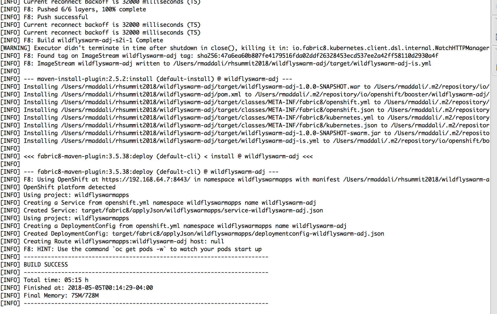
### Validating Application on OpenShift

* Login to OpenShift Console - with user admin/admin
* Click on Project ‘wildflyswarmapps’
* You should see pod running. See below pic for reference


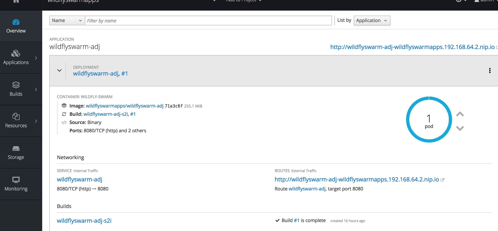

* Click on the route URL on the right corner.
[http://wildflyswarm-adj-wildflyswarmapps.{yourip}/]

You should a html page when enter 'Invoke' would be invoking a greeting rest service that we just deployed. Here is the screen shot.


### Create Adjective Rest Service

Now that we got an understanding on how build and deploy works, lets create a new service for returning list of adjectives


Create Adjective Model Class

* package name: io.openshift.booster.adjective.model
* Class Name: Adjective


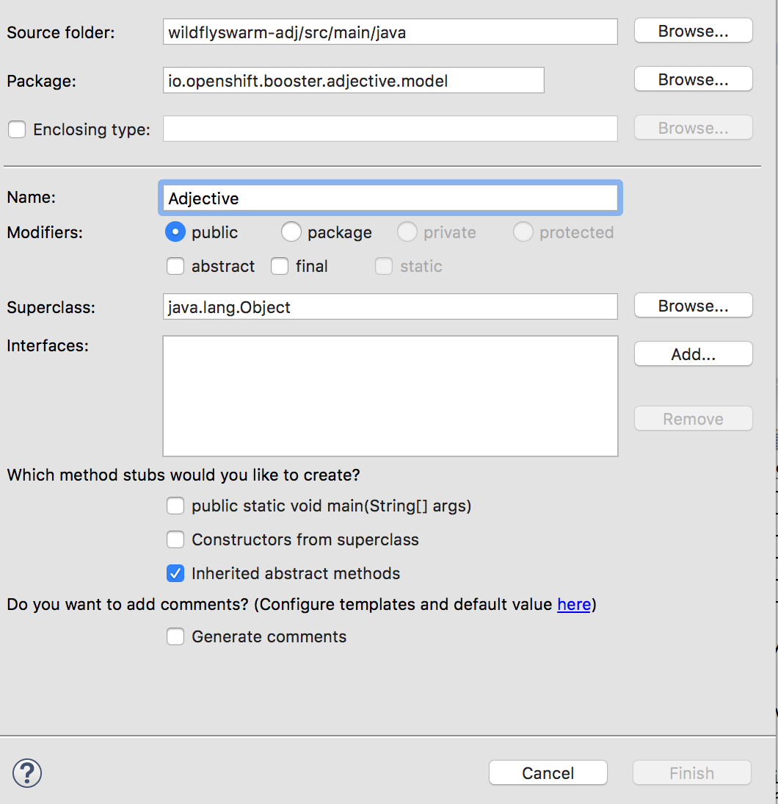

Copy paste below class into Adjective class

```java
 
package io.openshift.booster.adjective.model;

import java.util.Objects;

public class Adjective {

private String adjective;

public Adjective() {
}

public Adjective(String adjective) {
this.adjective = adjective;
}

public String getAdjective() {
return adjective;
}

public Adjective adjective(String adjective) {
this.adjective = adjective;
return this;
}

@Override
public boolean equals(Object o) {
if (this == o) return true;
if (o == null || getClass() != o.getClass()) return false;
Adjective adjective1 = (Adjective) o;
return Objects.equals(adjective, adjective1.adjective);
}

@Override
public int hashCode() {
return Objects.hash(adjective);
}

@Override
public String toString() {
final StringBuffer sb = new StringBuffer("Adjective{");
sb.append("adjective='").append(adjective).append('\'');
sb.append('}');
return sb.toString();
}
}
```
Create Adjective Rest Service class(File->New->Class)

package name: io.openshift.booster.adjective.service

Class Name: AdjectiveResource


Copy following code for AdjectiveResource class

```
package io.openshift.booster.adjective.service;

import java.io.BufferedReader;
import java.io.InputStream;
import java.io.InputStreamReader;
import java.util.ArrayList;
import java.util.List;
import java.util.Random;

import javax.annotation.PostConstruct;
import javax.enterprise.context.ApplicationScoped;
import javax.ws.rs.Consumes;
import javax.ws.rs.DELETE;
import javax.ws.rs.GET;
import javax.ws.rs.POST;
import javax.ws.rs.Path;
import javax.ws.rs.PathParam;
import javax.ws.rs.Produces;
import javax.ws.rs.core.MediaType;
import javax.ws.rs.core.Response;


import io.openshift.booster.adjective.model.Adjective;

/**
 * @author Ken Finnigan
 */
@Path("/")
@ApplicationScoped


public class AdjectiveResource {

    private List<Adjective> adjectives = new ArrayList<>();

    @PostConstruct
    public void loadData() {
        try {
            InputStream is = this.getClass().getClassLoader().getResourceAsStream("adjectives.txt");
            if (is != null) {
                BufferedReader reader = new BufferedReader(new InputStreamReader(is));
                reader.lines()
                        .forEach(adj -> adjectives.add(new Adjective(adj.trim())));
            }
        } catch (Exception e) {
            e.printStackTrace();
        }
    }

    @GET
    @Produces(MediaType.APPLICATION_JSON)
    @Path("/adjective")
    public Adjective getAdjective() {
        return adjectives.get(new Random().nextInt(adjectives.size()));
    }

    @POST
    @Consumes(MediaType.APPLICATION_JSON)
    @Produces(MediaType.APPLICATION_JSON)
    public Response addAdjective(Adjective adjective) {
        if (adjectives.contains(adjective)) {
            return Response
                    .status(Response.Status.CONFLICT)
                    .build();
        }

        adjectives.add(adjective);

        return Response
                .status(Response.Status.CREATED)
                .entity(adjective)
                .build();
    }

    @DELETE
    @Path("/{adjective}")
    public Response deleteAdjective(@PathParam("adjective") String adjectiveName) {
        Adjective deletingAdjective = new Adjective(adjectiveName);

        if (!adjectives.contains(deletingAdjective)) {
            return Response
                    .status(Response.Status.NOT_FOUND)
                    .build();
        }

        adjectives.remove(deletingAdjective);

        return Response
                .noContent()
                .build();
    }
}
```
### Create list of adjectives in a text file for our new AdjectiveResource Rest service to return adjectives

File->New -> File under src/main/resources

Name: adjectives.txt

Copy paste below adjectives into adjectives.txt file

```
artless
base-court
bawdy
bat-fowling
beslubbering
beef-witted
bootless
beetle-headed
churlish
boil-brained
cockered
clapper-clawed
clouted
clay-brained
craven
common-kissing
currish
crook-pated
dankish
dismal-dreaming
dissembling
dizzy-eyed
droning
doghearted
errant
dread-bolted
fawning
earth-vexing
fobbing
elf-skinned
froward
fat-kidneyed
frothy
fen-sucked
gleeking
flap-mouthed
goatish
fly-bitten
gorbellied
folly-fallen
impertinent
fool-born
infectious
full-gorged
jarring
guts-griping
loggerheaded
half-faced
lumpish
hasty-witted
mammering
hedge-born
mangled
hell-hated
mewling
idle-headed
paunchy
ill-breeding
pribbling
ill-nurtured
puking
knotty-pated
puny
milk-livered
qualling
motley-minded
rank
onion-eyed
reeky
plume-plucked
roguish
pottle-deep
ruttish
pox-marked
saucy
reeling-ripe
spleeny
rough-hewn
spongy
rude-growing
surly
rump-fed
tottering
shard-borne
unmuzzled
sheep-biting
vain
spur-galled
venomed
swag-bellied
villainous
tardy-gaited
warped
tickle-brained
wayward
toad-spotted
weedy
unchin-snouted
yeasty
weather-bitten
cullionly
whoreson
fusty
malmsey-nosed
caluminous
rampallian
wimpled
lily-livered
burly-boned
scurvy-valiant
misbegotten
brazen-faced
odiferous
unwash'd
poisonous
bunch-back'd
fishified
leaden-footed
wart-necked
muddy-mettled
pigeon-liver'd
scale-sided
```
Edit src/main/webapp/index.html ( home page for our rest service for viewing response from AdjectiveResource rest service)


```
<html>
<head>
    <meta charset="utf-8">
    <title>WildflySwarm- AdjectiveService</title>
    <link rel="stylesheet" href="https://maxcdn.bootstrapcdn.com/bootstrap/3.3.7/css/bootstrap.min.css"
          integrity="sha384-BVYiiSIFeK1dGmJRAkycuHAHRg32OmUcww7on3RYdg4Va+PmSTsz/K68vbdEjh4u" crossorigin="anonymous">
</head>

<body>
<div class="container">
    <div class="row">
        <div class="sect1">
<h2 id="_http_booster">Adjective Service Rest Endpoint</h2>
<div class="sectionbody">
<div class="paragraph">
<p>Adjective Service Rest Endpoint</p>
</div>
<div class="sect2">
<h3 id="_using_the_greeting_service">Using the Adjective service</h3>

</div>
</div>
</div>

        <form class="form-inline">
            <div class="form-group">
                <label for="name">Name</label>
                <input type="text" class="form-control" id="name" placeholder="World">
            </div>
            <button id="invoke" type="submit" class="btn btn-success">Invoke</button>
        </form>

        <p class="lead">Result:</p>
        <pre><code id="greeting-result">Invoke the service to see the result.</code></pre>
    </div>
</div>

<script src="https://ajax.googleapis.com/ajax/libs/jquery/1.12.4/jquery.min.js"></script>
<script src="https://maxcdn.bootstrapcdn.com/bootstrap/3.3.7/js/bootstrap.min.js"
        integrity="sha384-Tc5IQib027qvyjSMfHjOMaLkfuWVxZxUPnCJA7l2mCWNIpG9mGCD8wGNIcPD7Txa"
        crossorigin="anonymous"></script>

<script>
  $(document).ready(function () {
    $("#invoke").click(function (e) {
      var n = $("#name").val() || "World";
      $.getJSON("/api/adjective?name=" + n, function (res) {
        $("#greeting-result").text(JSON.stringify(res));
      });
      e.preventDefault();
    });
  });
</script>

</body>

</html>

```

Add following dependency to pom.xml as we are using CDI in our AdjectiveResource class
```
<dependency>

<groupId>org.wildfly.swarm</groupId>

<artifactId>cdi</artifactId>

</dependency>
```

** Deploy the service to Openshift

right click on the project(wildflyswar-adj) -> 'Run As' ->Run Configuration ->Select maven profile 'wildflyswarm-adj' and hit 'Run'

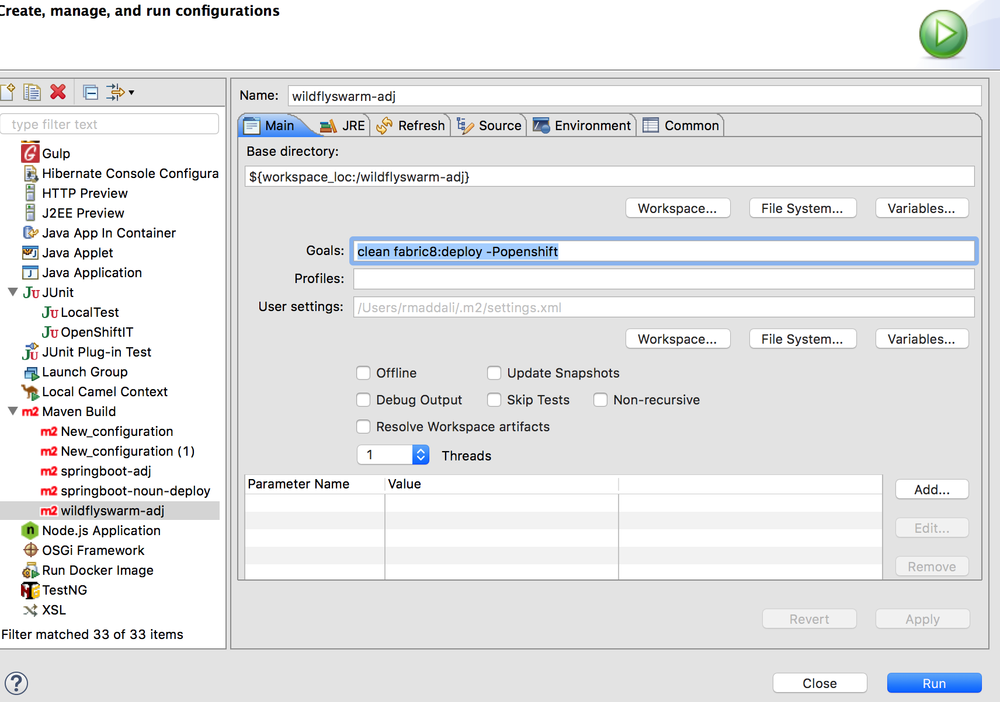


Successful build message should appear as follows

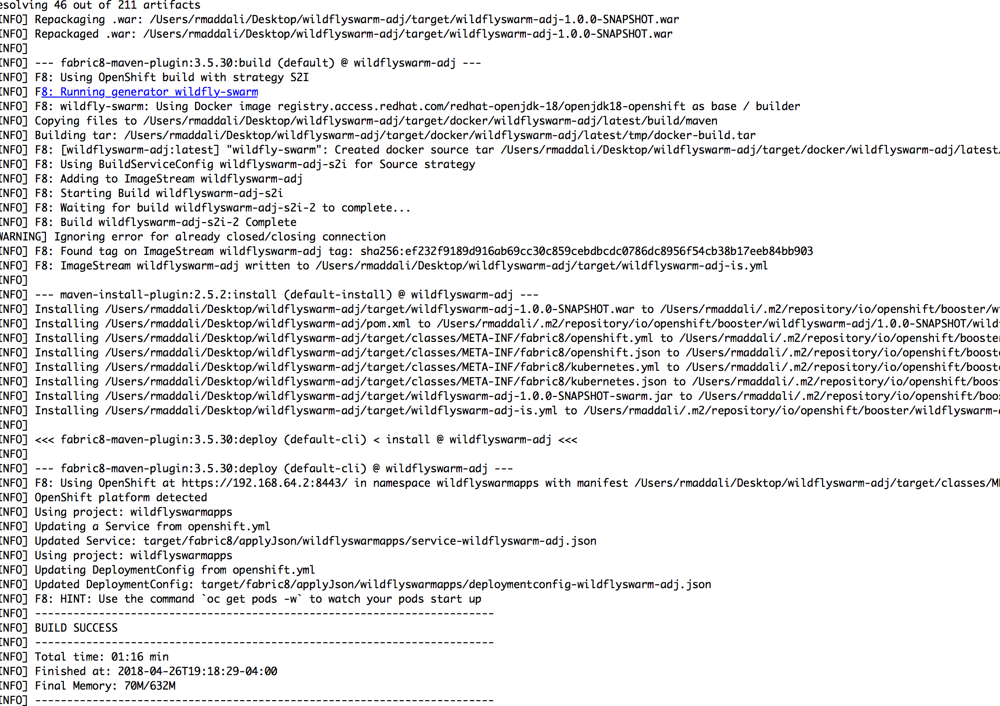

Access the deployed adjective service by going to OpenShift Console and look for a Route URL 

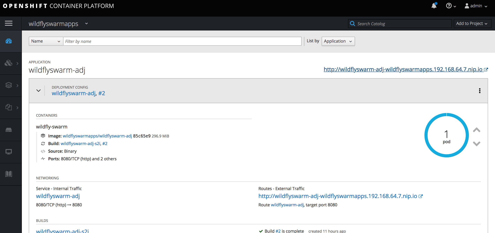

[http://wildflyswarm-adj-wildflyswarmapps.{**yourip**}/]

You should see the following webpage(index.html) when you access above URL. 

Click on Invoke to see the response from the Adjective Rest service


### Create Noun Rest Service Project Bundle with Fabric8 Launcher
* Start the Launcher, if you haven't already done so previously.
* Click on ‘Launch Your Project ‘
* Launcher will prompt you to login. You can type in your `developers.redhat.com` credentials to login.
* Select Deployment type  `I will build and run locally`

* Select mission `Rest API Level 0` can click `Next` to continue. Mission Control, as the name suggests, coordinates actions among dependent services. Its responsibility is to take the following inputs:
	* 	A GitHub Project
	* 	A GitHub project	
	* 	A GitHub user (via OAuth token)	
	* 	An OpenShift instance's API URL	
	* 	An OpenShift user (via OAuth token)	

	And performs the following actions:	
	
	* 	Fork the GitHub project into the GitHub user's namespace	
	* Create an OpenShift project	
	* Create a Jenkins Pipeline BuildConfig	
	* Associate the OpenShift project with the newly-forked GitHub repo	
	* Create a GitHub webhook on the newly-forked GitHub project to register push events to the OpenShift project	

* On the next screen select ‘Wildfly Swarm’ as the Runtime and hit ‘ Next’
	

* On the next screen add the following values for the parameters

	* Runtime Version: 2018.3.3 
	* GroupId - io.openshift.booster
	* ArtifactId - wildflyswarm-noun
	* Version - 1.0.0-SNAPSHOT


	


* Review the values in Review Screen

	

 * hit 'Download as Zip file', Download should begin on your system
 * Unzip the project


### Import Wildfly Noun Project to JBoss Developer Studio

*  Run the following command to unzip the downloaded project bundle, or you can just double click

```
$ unzip wildflyswarm-noun.zip
```
Note the location of your unzipped file.

* Open JBoss Developer Studio (Redsphere Icon) 
* Choose the following menu options to import the project
`File` ->`Import`-> `Maven` ->`Existing Maven Projects` , `Browse` to the location where the unzipped project is and select the project. (Most likely you may have unzipped it in the `Downloads` folder!!)


* Add following dependency in pom.xml
```
<dependency>
<groupId>org.wildfly.swarm</groupId>
<artifactId>cdi</artifactId>
</dependency>
```


* Create Noun Model Class (File->New->Class)

 Package: io.openshift.booster.noun.model
 Class Name: Noun
 


* Copy below details of the class

```

package io.openshift.booster.noun.model;


import java.util.Objects;

/**
 * @author Ken Finnigan
 */
public class Noun {

    private String noun;

    public Noun() {
    }

    public Noun(String noun) {
        this.noun = noun;
    }

    public String getNoun() {
        return noun;
    }

    public Noun noun(String noun) {
        this.noun = noun;
        return this;
    }

    @Override
    public boolean equals(Object o) {
        if (this == o) return true;
        if (o == null || getClass() != o.getClass()) return false;
        Noun noun1 = (Noun) o;
        return Objects.equals(noun, noun1.noun);
    }

    @Override
    public int hashCode() {
        return Objects.hash(noun);
    }

    @Override
    public String toString() {
        final StringBuffer sb = new StringBuffer("Noun{");
        sb.append("noun='").append(noun).append('\'');
        sb.append('}');
        return sb.toString();
    }
}

```
* Create NounResource Class


	Package: io.openshift.booster.noun.service
    	Name: NounResource
	


	* Copy below details of the class
```
package io.openshift.booster.noun.service;


import java.io.BufferedReader;
import java.io.InputStream;
import java.io.InputStreamReader;
import java.util.ArrayList;
import java.util.List;
import java.util.Random;

import javax.annotation.PostConstruct;
import javax.enterprise.context.ApplicationScoped;
import javax.ws.rs.Consumes;
import javax.ws.rs.DELETE;
import javax.ws.rs.GET;
import javax.ws.rs.POST;
import javax.ws.rs.Path;
import javax.ws.rs.PathParam;
import javax.ws.rs.Produces;
import javax.ws.rs.core.MediaType;
import javax.ws.rs.core.Response;


import io.openshift.booster.noun.model.Noun;


/**
 * @author Ken Finnigan
 */
@Path("/")
@ApplicationScoped

public class NounResource {

    private List<Noun> nouns = new ArrayList<>();

    @PostConstruct
    public void loadData() {
        try {
            InputStream is = this.getClass().getClassLoader().getResourceAsStream("noun.txt");
            if (is != null) {
                BufferedReader reader = new BufferedReader(new InputStreamReader(is));
                reader.lines()
                        .forEach(noun -> nouns.add(new Noun(noun.trim())));
            }
        } catch (Exception e) {
            e.printStackTrace();
        }
    }

    @GET
    @Produces(MediaType.APPLICATION_JSON)
    @Path("/noun")
    public Noun getNoun() {
        return nouns.get(new Random().nextInt(nouns.size()));
    }

    @POST
    @Consumes(MediaType.APPLICATION_JSON)
    @Produces(MediaType.APPLICATION_JSON)
    public Response addNoun(Noun noun) {
        if (nouns.contains(noun)) {
            return Response
                    .status(Response.Status.CONFLICT)
                    .build();
        }

        nouns.add(noun);

        return Response
                .status(Response.Status.CREATED)
                .entity(noun)
                .build();
    }

    @DELETE
    @Path("/{noun}")
    public Response deleteNoun(@PathParam("noun") String nounName) {
        Noun deletingNoun = new Noun(nounName);

        if (!nouns.contains(deletingNoun)) {
            return Response
                    .status(Response.Status.NOT_FOUND)
                    .build();
        }

        nouns.remove(deletingNoun);

        return Response
                .noContent()
                .build();
    }
}
```
* Create noun.txt(contains list of nouns that NounResource use to return Nouns) file under src/main/resources

Here are the content of noun.txt, please copy and paste it

```
 apple-john
 baggage
 barnacle
 bladder
 boar-pig
 bugbear
 bum-bailey
 canker-blossom
 clack-dish
 clotpole
 coxcomb
 codpiece
 death-token
 dewberry
 flap-dragon
 flax-wench
 flirt-gill
 foot-licker
 fustilarian
 giglet
 gudgeon
 haggard
 harpy
 hedge-pig
 horn-beast
 hugger-mugger
 joithead
 lewdster
 lout
 maggot-pie
 malt-worm
 mammet
 measle
 minnow
 miscreant
 moldwarp
 mumble-news
 nut-hook
 pigeon-egg
 pignut
 puttock
 pumpion
 ratsbane
 scut
 skainsmate
 strumpet
 varlot
 vassal
 whey-face
 wagtail
 knave
 blind-worm
 popinjay
 scullian
 jolt-head
 malcontent
 devil-monk
 toad
 rascal
 Basket-Cockle
 rapscallion

```
* Open src/main/webapp/index.html ( home page for our noun service to show result response from Noun Service)
 Copy below index.html contents
 
 ```
 
 <!--
  ~
  ~  Copyright 2016-2017 Red Hat, Inc, and individual contributors.
  ~
  ~  Licensed under the Apache License, Version 2.0 (the "License");
  ~  you may not use this file except in compliance with the License.
  ~  You may obtain a copy of the License at
  ~
  ~  http://www.apache.org/licenses/LICENSE-2.0
  ~
  ~  Unless required by applicable law or agreed to in writing, software
  ~  distributed under the License is distributed on an "AS IS" BASIS,
  ~  WITHOUT WARRANTIES OR CONDITIONS OF ANY KIND, either express or implied.
  ~  See the License for the specific language governing permissions and
  ~  limitations under the License.
  ~
  -->

<html>

<head>

  <meta charset="utf-8">
  <title>NounService - WildFly Swarm</title>

  <link rel="stylesheet" href="https://maxcdn.bootstrapcdn.com/bootstrap/3.3.7/css/bootstrap.min.css"
        integrity="sha384-BVYiiSIFeK1dGmJRAkycuHAHRg32OmUcww7on3RYdg4Va+PmSTsz/K68vbdEjh4u" crossorigin="anonymous">

</head>

<body>

<div class="container">

  <div>
    <div class="sect1">
<h2 id="_http_booster">NounService</h2>
<div class="sectionbody">
<div class="paragraph">
<p>An example of simple mapping of a business operation to a remote endpoint. By taking this approach, clients use the HTTP protocol as a transport mechanism to call services. Application engineers define the APIs using a broad interpretation of the REST fundamentals, encouraging freedom in design and quick prototyping.</p>
</div>
<div class="sect2">
<h3 id="_using_the_greeting_service">Using the Noun service</h3>

</div>
</div>
</div>

    <form class="form-inline">
      <div class="form-group">
        <label for="name">Name</label>
        <input type="text" class="form-control" id="name" placeholder="World">
      </div>
      <button id="invoke" type="submit" class="btn btn-success">Invoke</button>
    </form>

    <h3>Result:</h3>
    <pre><code id="greeting-result">Invoke the service to see the result.</code></pre>
  </div>
</div>

<script src="https://ajax.googleapis.com/ajax/libs/jquery/1.12.4/jquery.min.js"></script>
<script src="https://maxcdn.bootstrapcdn.com/bootstrap/3.3.7/js/bootstrap.min.js"
        integrity="sha384-Tc5IQib027qvyjSMfHjOMaLkfuWVxZxUPnCJA7l2mCWNIpG9mGCD8wGNIcPD7Txa"
        crossorigin="anonymous"></script>

<script>
    $(document).ready(function() {
       $("#invoke").click(function(e) {
          var n = $("#name").val() || "World";
          $.getJSON("/api/noun?name=" + n, function(res) {
              $("#greeting-result").text(JSON.stringify(res));
          });
          e.preventDefault();
       });
    });
</script>

</body>

</html>
 
 ```
 
* Deploy the service to Openshift

right click on the project(wildflyswar-noun) -> 'Run As' ->Run Configuration ->Select maven profile 'wildflyswarm-noun' and hit 'Run'

  * Note: if this is first time you are deploying wildflyswarm-noun service, please select maven -> click on new launch configuration -> enter below details
  
  	Base Directory: ${workspace_loc:/wildflyswarm-noun}
	Goals: clean fabric8:deploy -Popenshift
  
  


* You should see a maven build successful message


* Access the deployed adjective service by going to OpenShift Console and look for a Route URL 

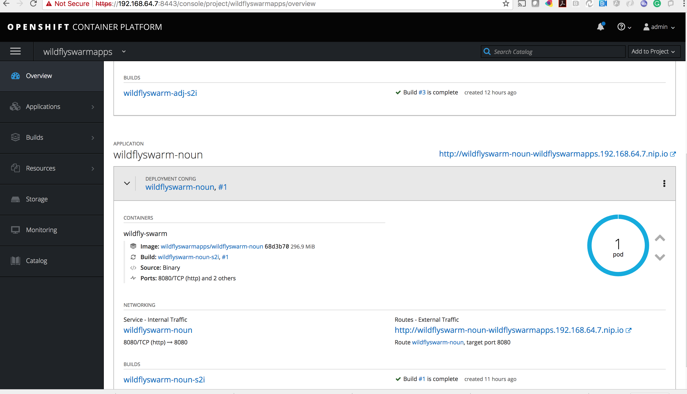

[http://wildflyswarm-adj-wildflyswarmapps.{**yourip**}/]

You should see the following webpage(index.html) when you access above URL. 

* Click on Invoke to see the response from the Adjective Rest service


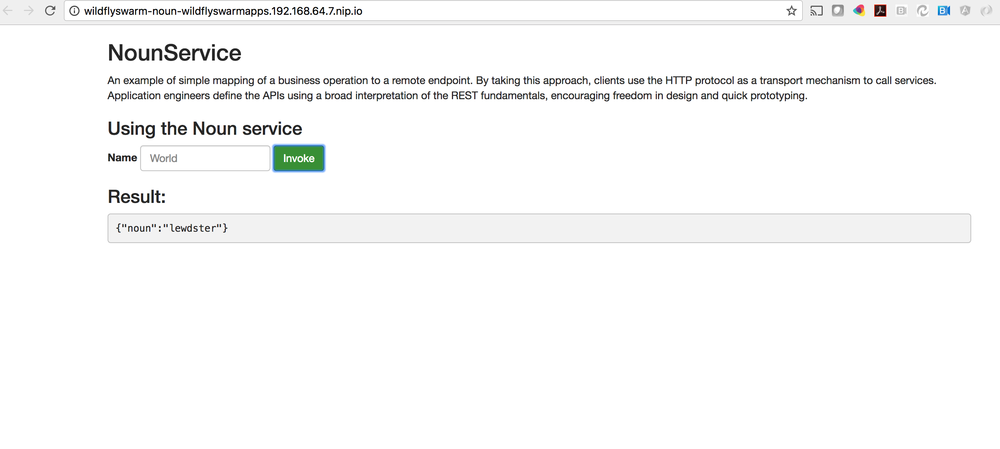


### Create Insult Rest Service Project Bundle with Fabric8 Launcher

* Start the Launcher, if you haven't already done so previously.
* Click on ‘Launch Your Project ‘
* Launcher will prompt you to login. You can type in your `developers.redhat.com` credentials to login.
* Select Deployment type  `I will build and run locally`

* Select mission `Rest API Level 0` can click `Next` to continue. Mission Control, as the name suggests, coordinates actions among dependent services. Its responsibility is to take the following inputs:
	* 	A GitHub Project
	* 	A GitHub project	
	* 	A GitHub user (via OAuth token)	
	* 	An OpenShift instance's API URL	
	* 	An OpenShift user (via OAuth token)	

	And performs the following actions:	
	
	* 	Fork the GitHub project into the GitHub user's namespace	
	* Create an OpenShift project	
	* Create a Jenkins Pipeline BuildConfig	
	* Associate the OpenShift project with the newly-forked GitHub repo	
	* Create a GitHub webhook on the newly-forked GitHub project to register push events to the OpenShift project	

* On the next screen select ‘Wildfly Swarm’ as the Runtime and hit ‘ Next’
	

* On the next screen add the following values for the parameters

	* Runtime Version: 2018.5.0
	* GroupId - io.openshift.booster
	* ArtifactId - wildflyswarm-insult
	* Version - 1.0.0-SNAPSHOT


	


* Review the values in Review Screen

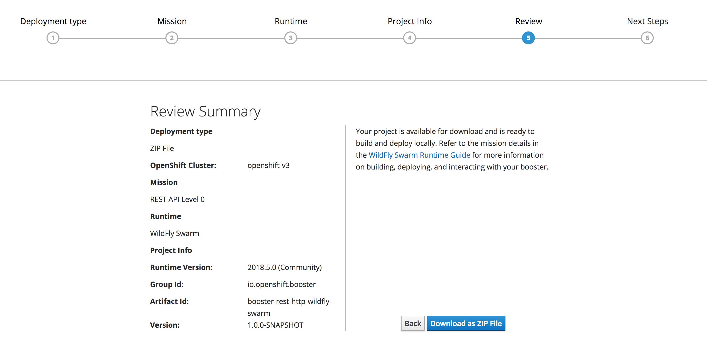	


 * hit 'Download as Zip file', Download should begin on your system
 * Unzip the project


* You should see the next step as shown below
	

### Import Project to JBoss Developer Studio

*  Run the following command to unzip the downloaded project bundle, or you can just double click

```
$ unzip wildflyswarm-insult.zip
```
Note the location of your unzipped file.

* Open JBoss Developer Studio (Redsphere Icon) 
* Choose the following menu options to import the project
`File` ->`Import`-> `Maven` ->`Existing Maven Projects` , `Browse` to the location where the unzipped project is and select the project. (Most likely you may have unzipped it in the `Downloads` folder!!)


* Add following dependencies in pom.xml
```
	<dependency>
		<groupId>org.wildfly.swarm</groupId>
		<artifactId>cdi</artifactId>
	</dependency>
	<dependency>
		<groupId>org.jboss.resteasy</groupId>
	 	<artifactId>resteasy-client</artifactId>
	  	<version>3.0.19.Final</version>
	   	<scope>provided</scope>
	</dependency>
```

* Create Insult Model Class (File->New->Class)

 Package: io.openshift.booster.insult.model
 Class Name: Insult
 
 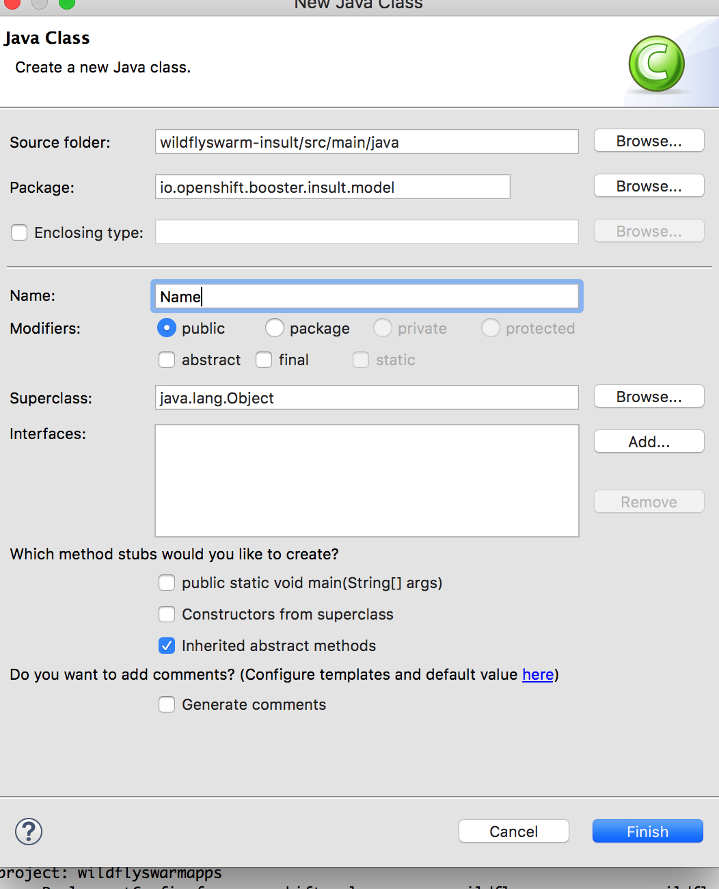
 

* Copy below details of the class


```
package io.openshift.booster.insult.model;

import com.fasterxml.jackson.annotation.JsonIgnore;

public class Insult {
    private String noun;

    private String adjective;

    @JsonIgnore
    private String adj2;

    @JsonIgnore
    private String name;

    public String getNoun() {
        return noun;
    }

    public Insult noun(String noun) {
        this.noun = noun;
        return this;
    }

    public String getAdjective() {
        return adjective;
    }

    public Insult adj1(String adj1) {
        this.adjective = adj1;
        return this;
    }

    public String getAdj2() {
        return adj2;
    }

    public Insult adj2(String adj2) {
        this.adj2 = adj2;
        return this;
    }

    public String getName() {
        return name;
    }

    public Insult name(String name) {
        this.name = name;
        return this;
    }
}

```

* Create Name Class


	Package: io.openshift.booster.insult.model
    	Name: Name
	


* Copy the following code into Name class

```
package io.openshift.booster.insult.model;

public class Name {
    private String name;

    public String getName() {
        return name;
    }

    public Name name(String name) {
        this.name = name;
        return this;
    }
}
```


* Create Noun Class


	Package: io.openshift.booster.noun.model
    	Name: Noun

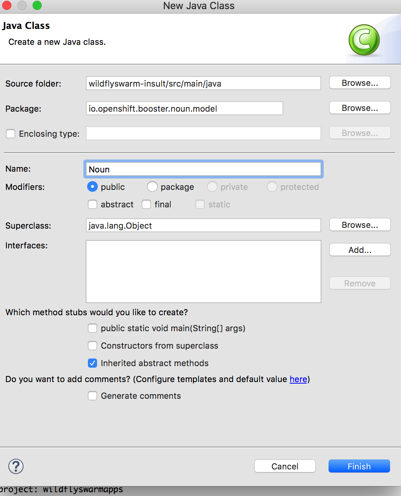


* Copy the following code into Noun class

```
package io.openshift.booster.noun.model;
	
	public class Noun {

	    private String noun;

	    public Noun() {
	    }

	    public Noun(String noun) {
	        this.noun = noun;
	    }

	    public String getNoun() {
	        return noun;
	    }

	    public Noun noun(String noun) {
	        this.noun = noun;
	        return this;
	    }
	}

```

* Create NounService Interface


	Package: io.openshift.booster.noun.service
    	Name: NounService

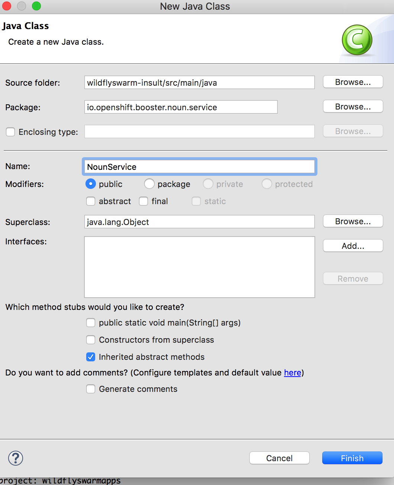


* Copy the following code into NounService interface

```
package io.openshift.booster.noun.service;

import javax.ws.rs.GET;
import javax.ws.rs.Path;
import javax.ws.rs.Produces;
import javax.ws.rs.core.MediaType;

import io.openshift.booster.noun.model.Noun;


	
	
	

	/**
	 * @author Ken Finnigan
	 */
	@Path("/")
	public interface NounService {
	    @GET
	    @Produces(MediaType.APPLICATION_JSON)
	    @Path("/noun")
	    Noun getNoun();
	

}

```

* Create Adjective class


	Package: io.openshift.booster.adjective.model
    	Name: Adjective

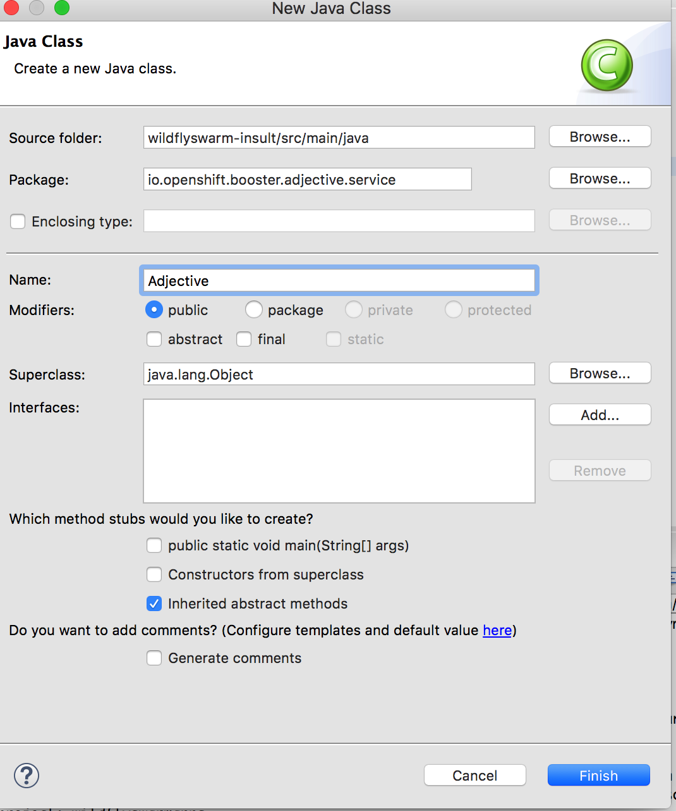


* Copy the following code into Adjective class


```
package io.openshift.booster.adjective.model;

/**
 * @author Ken Finnigan
 */
public class Adjective {

    private String adjective;

    public Adjective() {
    }

    public Adjective(String adjective) {
        this.adjective = adjective;
    }

    public String getAdjective() {
        return adjective;
    }

    public Adjective adjective(String adjective) {
        this.adjective = adjective;
        return this;
    }
}


```


* Create AdjectiveService Interface


	Package: io.openshift.booster.adjective.service
    	Name: AdjectiveService

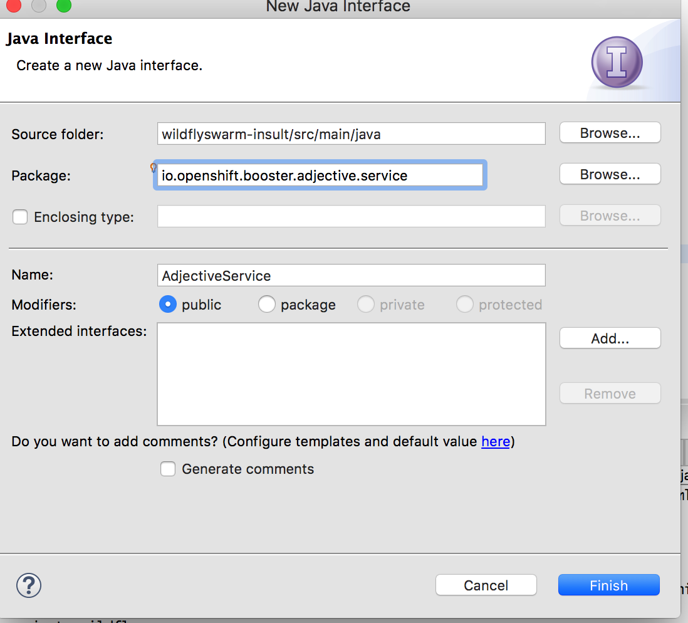


* Copy the following code into AdjectiveService interface

```

package io.openshift.booster.adjective.service;

import javax.ws.rs.GET;
import javax.ws.rs.Path;
import javax.ws.rs.Produces;
import javax.ws.rs.core.MediaType;

import io.openshift.booster.adjective.model.Adjective;

/**
 * @author Ken Finnigan
 */
@Path("/")
public interface AdjectiveService {
    @GET
    @Produces(MediaType.APPLICATION_JSON)
    @Path("/adjective")
    Adjective getAdjective();
}
```

* Create InsultService class


	Package: io.openshift.booster.insult.service
    	Name: InsultService

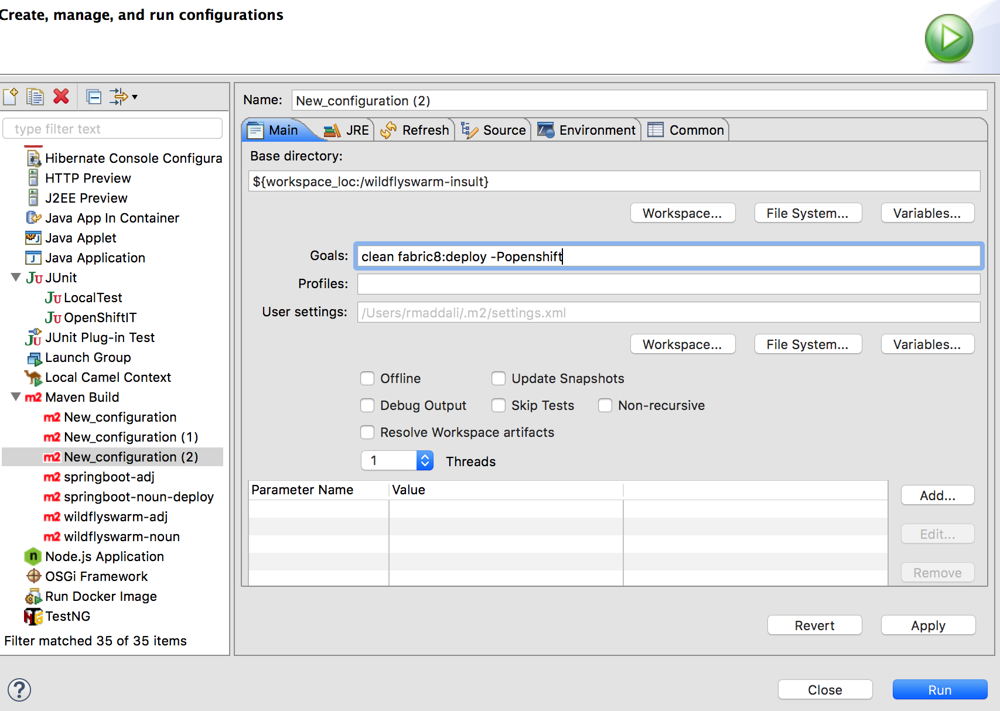


* Copy the following code into InsultService 


```
package io.openshift.booster.insult.service;
import javax.enterprise.context.ApplicationScoped;
import javax.ws.rs.Consumes;
import javax.ws.rs.GET;
import javax.ws.rs.POST;
import javax.ws.rs.Path;
import javax.ws.rs.Produces;
import javax.ws.rs.core.MediaType;

import org.jboss.resteasy.client.jaxrs.ResteasyClient;
import org.jboss.resteasy.client.jaxrs.ResteasyClientBuilder;
import org.jboss.resteasy.client.jaxrs.ResteasyWebTarget;

import io.openshift.booster.adjective.service.AdjectiveService;
import io.openshift.booster.insult.model.Insult;
import io.openshift.booster.insult.model.Name;
import io.openshift.booster.noun.service.NounService;

@Path("/")
@ApplicationScoped
public class InsultService {
	

    @GET
    @Produces(MediaType.APPLICATION_JSON)
    @Path("/insult")
    public Insult getInsult() throws Exception {
    	
    	 System.out.println("cakked-");
        return insultByName(null);
    }

    @POST
    @Consumes(MediaType.APPLICATION_JSON)
    @Produces(MediaType.APPLICATION_JSON)
    @Path("/nameinsult")
    public Insult insultByName(Name name) throws Exception {
        
        ResteasyClient client = new ResteasyClientBuilder().build();
        ResteasyWebTarget rtarget = client.target("http://wildflyswarm-noun:8080/api");
        NounService nounService = rtarget.proxy(NounService.class); 
       
//       URI uri= new URI("http", null, serviceEntry.getAddress(), serviceEntry.getPort(), null, null, null);
        
//        String n = new NounCommand("http://wildflyswarm-noun:8080/api").execute().getNoun();
       
        ResteasyClient adjClient = new ResteasyClientBuilder().build();
        ResteasyWebTarget adjTarget = adjClient.target("http://wildflyswarm-adj:8080/api");
        AdjectiveService adjService = adjTarget.proxy(AdjectiveService.class);

        return new Insult()
                .noun(nounService.getNoun().getNoun())
                .adj1(adjService.getAdjective().getAdjective())
                .adj2(adjService.getAdjective().getAdjective())
                .name(name != null ? name.getName() : null);
    }

   
}

```
* Open src/main/webapp/index.html ( home page for our insult service to show result response from Insult Service)
 Copy below index.html contents

```

<html lang="en">
<!--
  ~
  ~  Copyright Red Hat, Inc, and individual contributors.
  ~
  ~  Licensed under the Apache License, Version 2.0 (the "License");
  ~  you may not use this file except in compliance with the License.
  ~  You may obtain a copy of the License at
  ~
  ~  http://www.apache.org/licenses/LICENSE-2.0
  ~
  ~  Unless required by applicable law or agreed to in writing, software
  ~  distributed under the License is distributed on an "AS IS" BASIS,
  ~  WITHOUT WARRANTIES OR CONDITIONS OF ANY KIND, either express or implied.
  ~  See the License for the specific language governing permissions and
  ~  limitations under the License.
  ~
  -->

<head>
  <meta charset="utf-8">
  <title>CloudNative Workshop - WildFly Swarm</title>
  <link rel="stylesheet"
        href="https://maxcdn.bootstrapcdn.com/bootstrap/4.0.0-beta.3/css/bootstrap.min.css"
        integrity="sha384-Zug+QiDoJOrZ5t4lssLdxGhVrurbmBWopoEl+M6BdEfwnCJZtKxi1KgxUyJq13dy"
        crossorigin="anonymous">
  <meta name="viewport" content="width=device-width, initial-scale=1, shrink-to-fit=no">
</head>

<body>

<div class="container">
  <h1 class="display-3">CloudNative Workshop</h1>

  <div class="row">
    <div class="col-6">
      <h2 class="display-6">WildFly Swarm</h2>
      <p class="lead">
        This showcases an implementation of a silly but fun
        application built using the microservices design pattern.
        There are three services involved, in addition to the front
        end which you are currently viewing.
      </p>
    </div>
    

  </div>

  <div class="row" style="margin-top:20px">

    <div class="col">
      <div class="card">
        <div class="card-body">
          <h2 class="card-title">Insult service</h2>
          <p class="card-text">
            Tap or click the button below to be insulted. Provide
            your name to make it personal.
          <form id="form-submit"><input type="text" id="name"/></form>
          </p>
          <button id="invoke" class="btn btn-outline-primary">Insult Me!</button>
          <button id="clear" class="btn btn-outline-success">I Didn't Mean It</button>
        </div>
      </div>
    </div>
    <div class="col">
      <div class="card">
        <div class="card-body">
          <h2 class="card-title">Your Personal Insults</h2>
          <ul id="insults"></ul>
        </div>
      </div>
    </div>

  </div>
  <script src="https://code.jquery.com/jquery-3.2.1.min.js"
          integrity="sha256-hwg4gsxgFZhOsEEamdOYGBf13FyQuiTwlAQgxVSNgt4="
          crossorigin="anonymous"></script>
  <script src="https://cdnjs.cloudflare.com/ajax/libs/popper.js/1.12.9/umd/popper.min.js"
          integrity="sha384-ApNbgh9B+Y1QKtv3Rn7W3mgPxhU9K/ScQsAP7hUibX39j7fakFPskvXusvfa0b4Q"
          crossorigin="anonymous"></script>
  <script src="https://maxcdn.bootstrapcdn.com/bootstrap/4.0.0-beta.3/js/bootstrap.min.js"
          integrity="sha384-a5N7Y/aK3qNeh15eJKGWxsqtnX/wWdSZSKp+81YjTmS15nvnvxKHuzaWwXHDli+4"
          crossorigin="anonymous"></script>

  <script>
    $(document).ready(function() {

      function getOrPostInsult (e) {
        console.log($('#name').val())
        if ($('#name').val() === '') getInsult();
        else postInsult($('#name').val());
        e.preventDefault();
      }

      function getInsult () {
        $.getJSON('/api/insult', updateInsultList);
      }

      function postInsult (name) {
        $.ajax({
          type: 'POST',
          url: '/api/nameinsult',
          data: JSON.stringify({
            name
          }),
          dataType: 'json',
          contentType: "application/json; charset=utf-8",
          success: updateInsultList
        });
      }

      function updateInsultList (insult) {
        $('#insults').prepend($('<li>')//.addClass('list-group-item')
          .text(`${insult.name ? insult.name + ', t' : 'T'}hou ${insult.adj1}, ${insult.adj2} ${insult.noun}!`));
      }

      function clearInsultList (e) {
        $('#insults').html('');
        $('#name').val('');
        e.preventDefault();
      }

      // UI event handlers
      $('#clear').click(clearInsultList);
      $('#invoke').click(getOrPostInsult);
      $('#form-submit').submit(getOrPostInsult);
    });
  </script>
</div>
</body>

</html>

```

** Deploy the service to Openshift

right click on the project(wildflyswar-insult) -> 'Run As' ->Run Configuration ->Select maven profile 'wildflyswarm-insult' and hit 'Run'

* Note: if this is first time you are deploying wildflyswarm-insult service, please select maven -> click on new launch configuration -> enter below details
  
  	* Base Directory: ${workspace_loc:/wildflyswarm-insult}
	* Goals: clean fabric8:deploy -Popenshift
  
  


Successful build message should appear as follows

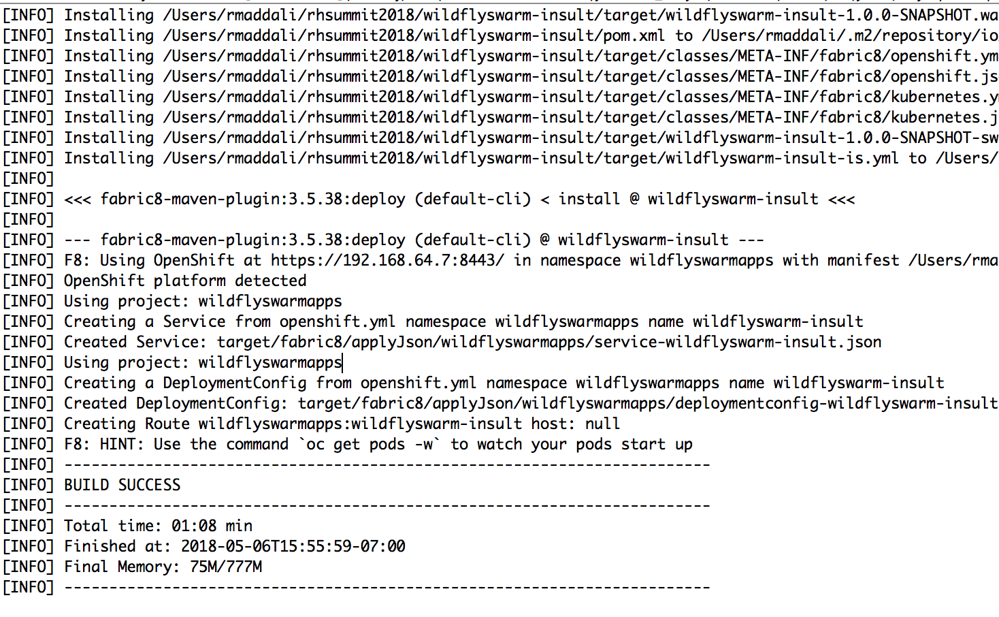

Access the deployed Insult service by going to OpenShift Console and look for a Route URL 


[http://wildflyswarm-insult-wildflyswarmapps.{**yourip**}/]

You should see the following webpage(index.html) when you access above URL. 

Click on Invoke to see the response from the Insult Rest service


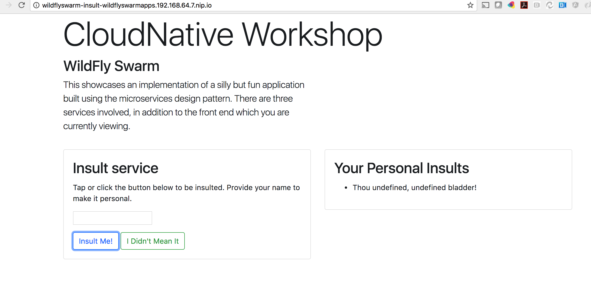


*** Deployment Testing

Arquillian is a revolutionary testing platform for Java and the JVM that enables developers to easily write and execute integration and functional tests for Java middleware, ranging from Java EE and beyond.

Using Arquillian, you write a basic test case and annotate it with declarative behavior that says, "`@RunWith` Arquillian". This declaration tells Arquillian to take over execution of the test when it’s launched.

The following example aims at demonstrating a black box approach to testing your deployment that neither mutates the containers (by deploying, reconfiguring etc) nor the Kubernetes/OpenShift resources.

The focus of the example is on immutable infrastructure and integration testing, wherein the test cases are meant to, consume and test the provided services and assert that the environment is in the expected state, providing you with the confidence that your application will work correctly when deployed on an OpenShift cluster.


* Edit src/test/java/io/openshift/booster/OpenShiftIT.java with following code

```

/*
 *
 *  Copyright 2016-2017 Red Hat, Inc, and individual contributors.
 *
 *  Licensed under the Apache License, Version 2.0 (the "License");
 *  you may not use this file except in compliance with the License.
 *  You may obtain a copy of the License at
 *
 *  http://www.apache.org/licenses/LICENSE-2.0
 *
 *  Unless required by applicable law or agreed to in writing, software
 *  distributed under the License is distributed on an "AS IS" BASIS,
 *  WITHOUT WARRANTIES OR CONDITIONS OF ANY KIND, either express or implied.
 *  See the License for the specific language governing permissions and
 *  limitations under the License.
 *
 */

package io.openshift.booster;


import static org.assertj.core.api.Assertions.assertThat;

import java.io.IOException;
import java.net.URL;

import org.arquillian.cube.kubernetes.annotations.Named;
import org.arquillian.cube.openshift.impl.enricher.AwaitRoute;
import org.arquillian.cube.openshift.impl.enricher.RouteURL;
import org.jboss.arquillian.junit.Arquillian;
import org.jboss.arquillian.test.api.ArquillianResource;
import org.junit.Test;
import org.junit.runner.RunWith;

import io.fabric8.kubernetes.api.model.v2_6.Service;
import io.fabric8.openshift.api.model.v2_6.DeploymentConfig;
import okhttp3.OkHttpClient;
import okhttp3.Request;
import okhttp3.Response;


/**
 * @author Heiko Braun
 */
@RunWith(Arquillian.class)
public class OpenshiftIT {

	@Named("wildflyswarm-insult")
    @ArquillianResource
    Service insult;

    

    @Named("wildflyswarm-insult")
    @ArquillianResource
    DeploymentConfig insultDC;

  

    @RouteURL("wildflyswarm-insult")
    @AwaitRoute
    URL url;

   

    @Test
    public void verify_insult_service_should_not_be_null() throws IOException {
        assertThat(insult).isNotNull();
        assertThat(insult.getSpec()).isNotNull();
        assertThat(insult.getSpec().getPorts()).isNotNull();
        assertThat(insult.getSpec().getPorts()).isNotEmpty();
    }

    
    @Test
    public void verify_insult_deployment_config_should_not_be_null() throws IOException {
        assertThat(insultDC).isNotNull();
        assertThat(insultDC.getStatus().getAvailableReplicas()).isEqualTo(1);
    }

    @Test
    public void verify_route_is_configured_and_insult_service_is_accessible() throws IOException {
        assertThat(url).isNotNull();
        OkHttpClient okHttpClient = new OkHttpClient();
        Request request = new Request.Builder().get().url(url).build();
        Response response = okHttpClient.newCall(request).execute();

        assertThat(response).isNotNull();
        assertThat(response.code()).isEqualTo(200);
        
    }
}


```

* Add following dependencies to pom.xml

<dependency>
      <groupId>org.arquillian.cube</groupId>
      <artifactId>arquillian-cube-requirement</artifactId>
      <scope>test</scope>
    </dependency>

    <!-- Fabric8 Client Dependencies-->
    <dependency>
      <groupId>io.fabric8</groupId>
      <artifactId>openshift-client</artifactId>
      <version>3.0.1</version>
    </dependency>
     <dependency>
      <groupId>org.assertj</groupId>
      <artifactId>assertj-core</artifactId>
      <version>3.8.0</version>
      <scope>test</scope>
    </dependency>
	
	
	
    
    
    
    

```


* Add below dependency under <dependencyManagement> section in pom.xml
```	
	<dependency>
        <groupId>org.arquillian.cube</groupId>
        <artifactId>arquillian-cube-bom</artifactId>
        <version>1.9.2</version>
        <scope>import</scope>
        <type>pom</type>
      </dependency>
   ```   


** Deploy the service to Openshift

right click on the project(wildflyswar-insult) -> 'Run As' ->Run Configuration ->Select maven profile 'wildflyswarm-insult' and hit 'Run'

* Note: if this is first time you are deploying wildflyswarm-insult service, please select maven -> click on new launch configuration -> enter below details
  
  	* Base Directory: ${workspace_loc:/wildflyswarm-insult}
	* Goals: clean fabric8:deploy -Popenshift -Popenshift-it
  
  


Successful build message should appear as follows

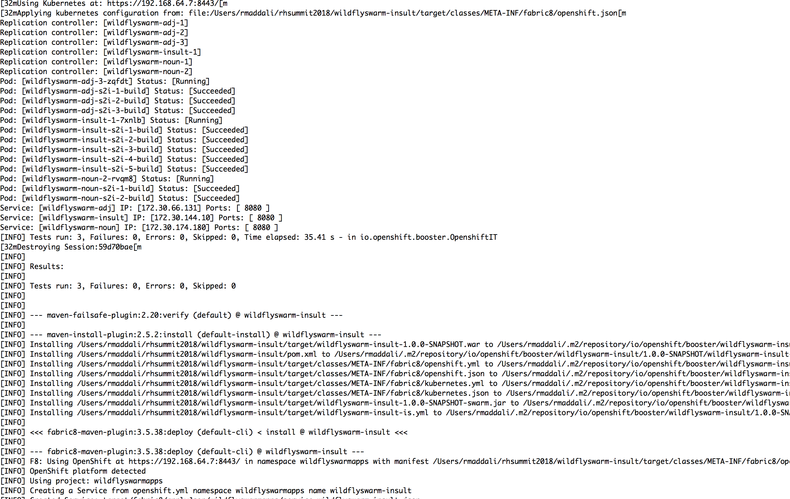


Please go through the maven build console logs, you would notice that tests for OpenShiftIT run successful with 0 failures.


