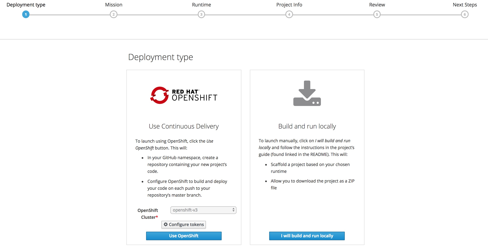
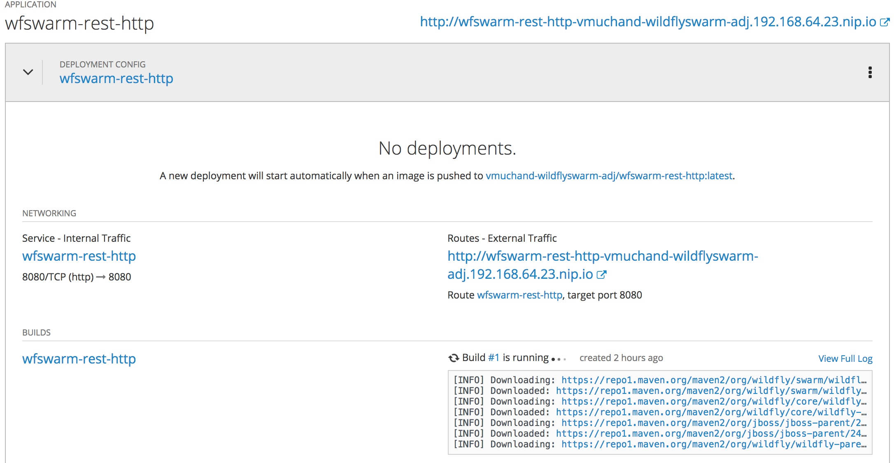
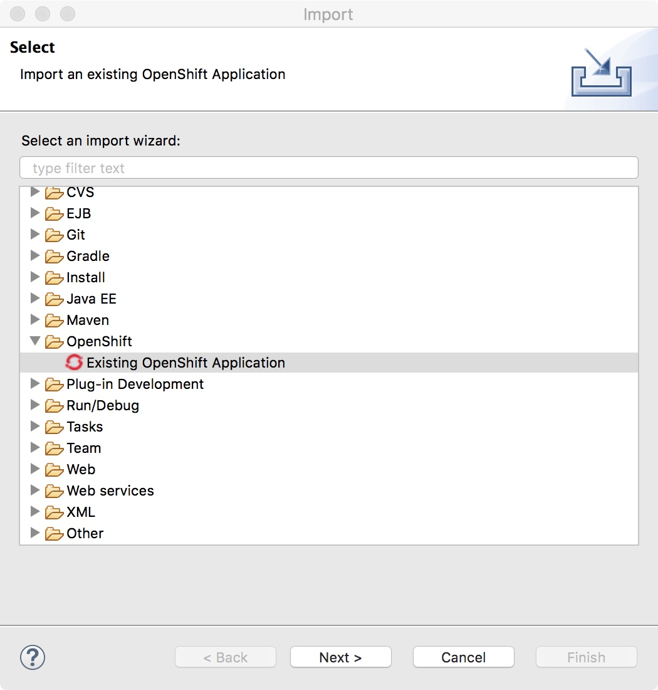
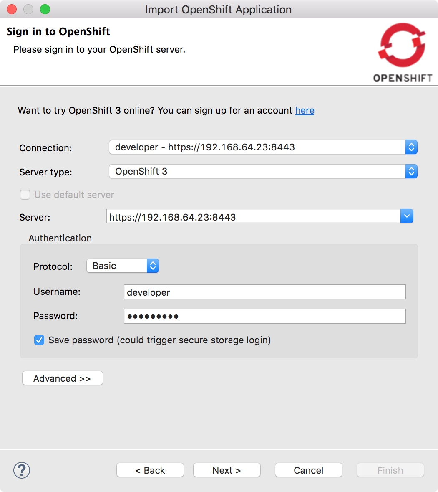
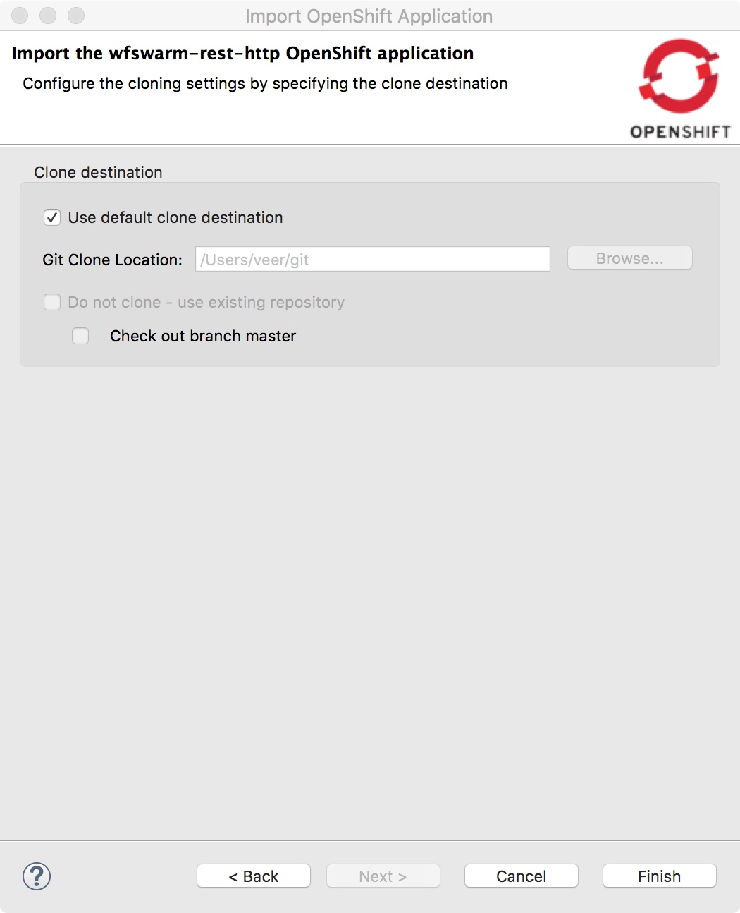
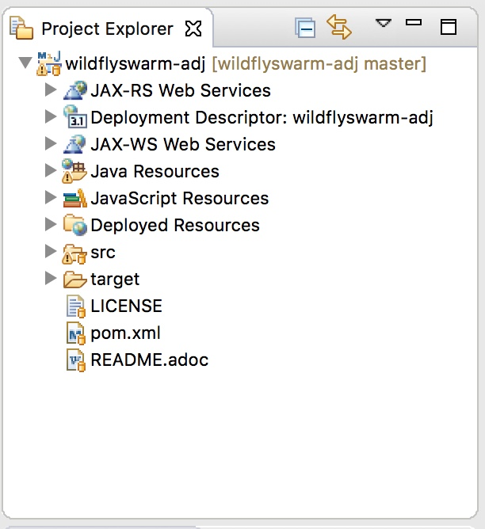

## Lab 5: Creating Wildfly Rest Services 

In this lab we will create 3 microservices. 

* Adjective microservice
* Noun Microservice
* Insult Microservice

Idea is to generate to random noun and an adjective to generate an insult. It is based on the following idea
http://www.literarygenius.info/a1-shakespearean-insults-generator.htm

### Prerequisites
* You should have CDK running
* Launchpad should have been installed on CDK
* JBoss Development Studio as IDE. You got this with JBoss Development Suite
* Apache Maven 3.5+

### Create Project Bundle with Fabric8 Launcher
* Start the Launcher, if you haven't already done so previously.
* Click on ‘Launch Your Project ‘

* Launcher will prompt you to login. You can type in your `developers.redhat.com` credentials to login.

* Select the Deployment type  `Use OpenShift`

* Select mission `Rest API Level 0` can click `Next` to continue. 

--------------

	
--------------------

* On the next screen select ‘Wildfly Swarm’ as the Runtime and hit ‘ Next’

	

* On the next screen `Project Info` page, click on `Additional Parameters` to see all paramters, and add the following parameters

	* Runtime Version: `2018.3.3` 
	* OpenShift Project Name: <yourusername>-`wildflyswarm-adj`
	* GroupId - `io.openshift.booster`
	* ArtifactId - `wildflyswarm-adj`
	* Version - `1.0.0-SNAPSHOT`

	
	

**Note** Please use the above values as we'll be using then throughout the lab.

* Next on `Review Summary` page, review the contents and press on `Launch on OpenShift` button.

	

Fabric8 Launcher coordinates actions among dependent services. It takes the following inputs that you filled above:

* 	A GitHub Project
* 	A GitHub user (via OAuth token)	
* 	An OpenShift instance's API URL	
* 	An OpenShift user (via OAuth token)	

And it performs the following actions:	

* Fork the GitHub template project into the GitHub user's namespace
* Create an OpenShift project		
* Associate the OpenShift project with the newly-forked GitHub repo
* Create a GitHub webhook on the newly-forked GitHub project to register push events to the OpenShift project	
	

Press on `Next` button.

* You should see the next step as shown below
	

Click on the link `Take a look at your build`, it will take you to the project on the Web Console. You will see the application with name `wfswarm-rest-http`. Expand this application tab by pressing on `>` symbol right next to its name. 

You'll observe that the build is running. It would be downloading dependencies from maven while running the build.

So, the launcher has automatically deployed an application and started a new build.

	

Also look at your github home page. You will see that launcher has created a repository with source code for you with the name `wildflyswarm-adj`. 

Wow, you now have template code to begin your first cloud native application!!!

### Import Project to JBoss Developer Studio

Let us now import this code into your IDE. Get into JBDS

* Right Click in the `Project Explorer` area and select `Import`-> `Import`. You'll see the following window where you'll navigate to `OpenShift` folder and `Existing OpenShift Application`

	

Click on Next. It should display a window to `Sign in to OpenShift`. Your openshift connection information to CDK should all be pre-configured for you.. Yeah!! Click on `Next` 

Now it should show you the list of projects running on your openshift cluster. Let us select the project that is hosting wildflyswarm-adj project

and once it expands select `wildflyswam-rest-http` application and press on `Next` button.

On the next page choose the `default clone destination` or if you want to use a different location and click on `Finish`.

This will import project to your JBDS and you'll see the project in the project explorer.

	

