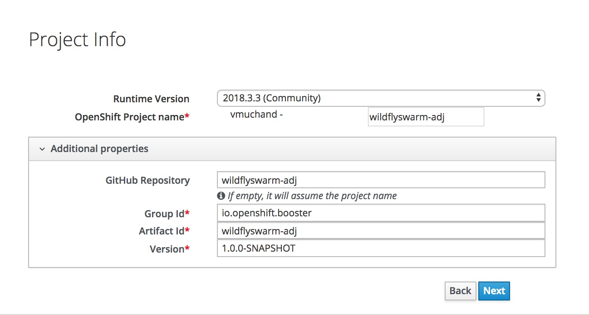
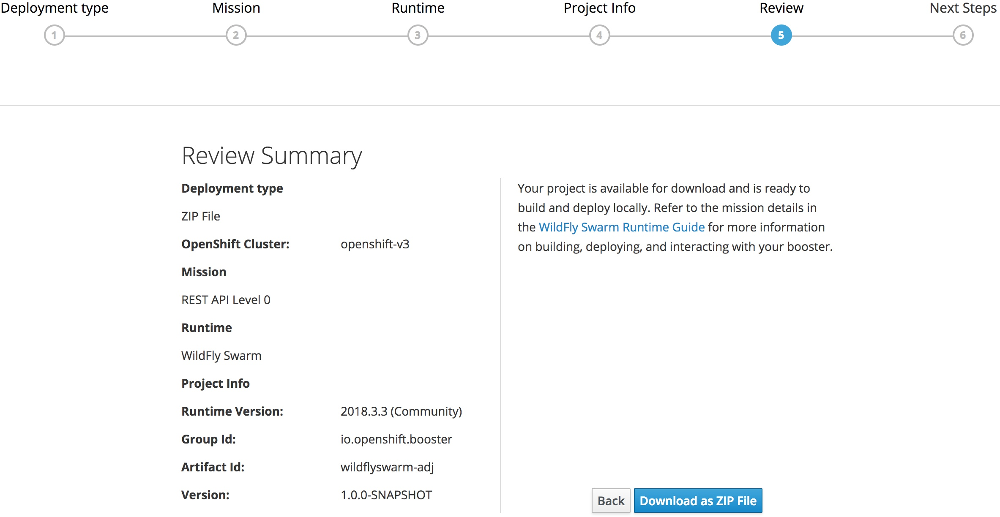

## Lab 5: Creating Wildfly Rest Services 

In this lab we will create 3 microservices. 

* Adjective microservice
* Noun Microservice
* Insult Microservice

Idea is to generate to random noun and an adjective to generate an insult. It is based on the following idea
http://www.literarygenius.info/a1-shakespearean-insults-generator.htm

### Prerequisites
* You should have CDK running
* Launchpad should have been installed on CDK
* JBoss Development Studio as IDE. You got this with JBoss Development Suite
* Apache Maven 3.5+


### Create Project Bundle with Fabric8 Launcher
* Start the Launcher, if you haven't already done so previously.
* Click on ‘Launch Your Project ‘
* Launcher will prompt you to login. You can type in your `developers.redhat.com` credentials to login.
* Select Deployment type  `I will build and run locally`

* Select mission `Rest API Level 0` can click `Next` to continue. Mission Control, as the name suggests, coordinates actions among dependent services. Its responsibility is to take the following inputs:
	* 	A GitHub Project
	* 	A GitHub project	
	* 	A GitHub user (via OAuth token)	
	* 	An OpenShift instance's API URL	
	* 	An OpenShift user (via OAuth token)	

	And performs the following actions:	
	
	* 	Fork the GitHub project into the GitHub user's namespace	
	* Create an OpenShift project	
	* Create a Jenkins Pipeline BuildConfig	
	* Associate the OpenShift project with the newly-forked GitHub repo	
	* Create a GitHub webhook on the newly-forked GitHub project to register push events to the OpenShift project	

* On the next screen select ‘Wildfly Swarm’ as the Runtime and hit ‘ Next’
	

* On the next screen add the following values for the parameters

	* Runtime Version: 2018.3.3 
	* GroupId - io.openshift.booster
	* ArtifactId - wildflyswarm-adj
	* Version - 1.0.0-SNAPSHOT
	

**Note** Please use the above values as we'll be using then throught the lab.

* Review Summary on the next page and press on `Download as Zip File` button.

	

Your application bundle will be downloaded as `wildflyswarm-adj.zip`.

* You should see the next step as shown below
	

### Import Project to JBoss Developer Studio

*  Run the following command to unzip the downloaded project bundle, or you can just double click

```
$ unzip wildflyswarm-adj.zip
```
Note the location of your unzipped file.

* Open JBoss Developer Studio (Redsphere Icon) 
* Choose the following menu options to import the project
`File` ->`Import`-> `Maven` ->`Existing Maven Projects` , `Browse` to the location where the unzipped project is and select the project. (Most likely you may have unzipped it in the `Downloads` folder!!)

* Explore the project i.e, expand `wildflyswarm-adj` project and look at `src/main/java` 

Explore the following auto-generated code (by the launcher):
* GreetingEndpoint.java

```
package io.openshift.booster;

import javax.ws.rs.GET;
import javax.ws.rs.Path;
import javax.ws.rs.Produces;
import javax.ws.rs.QueryParam;

@Path("/")
public class GreetingEndpoint {

    private static final String template = "Hello, %s!";

    @GET
    @Path("/greeting")
    @Produces("application/json")
    public Greeting greeting(@QueryParam("name") String name) {
        String suffix = name != null ? name : "World";
        return new Greeting(String.format(template, suffix));
    }
}

```

* ApplicationConfig is an auto generated class for Resource Entrypoint

```
package io.openshift.booster;

import javax.ws.rs.ApplicationPath;
import javax.ws.rs.core.Application;

/**
 * Resource entry point
 */
@ApplicationPath("/api")
public class ApplicationConfig extends Application {

}
```

Now, let us deploy this application to OpenShift and test it.

### Deploying Application into OpenShift

* Lets first create a project/namespace on openshift where will deploy wildfly swarm based apps. Open a terminal and run the following commands on CLI:

```
$ oc new-project wildflyswarmapps --display-name="wildflyswarmapps" --description="wildflyswarmapps"

```

Now lets deploy our new wildflyswarm-adj app from JBDS.

* Right click on the project `wildflyswarm-adj` ->`Run As` -> `Run Configurations`
	

* Then choose `Maven_Build` -> `New_Configuration` :

	* Name: `wildflyswarm-adj-deploy`	
	* BaseDirectory: `workspace`->`select wildflyswarm-adj`	
	* Goals: `clean fabric8:deploy -Popenshift`
  Then click on `Run`
  
* Watch the build logs in Console tab. The build runs for a couple of minutes, runs test cases,  and you should see the following at the end.

```

```	


