## Lab 6: Creating a Vertx gateway with Circuit Breaker

In this lab we will create 3 microservices in 3 different runtimes supported by Red Hat OpenShift Application Runtimes (RHOAR)

* Create the SpringBoot adjective service
* Create the WildFly Swarm noun service
* Create the Vertx gateway

### Pre-requisites

Must have completed labs 1-3. We will be using those components for following labs

### Description

The idea of this lab is to generate a random noun and an adjective to generate an insult. It is based on the following idea:  
http://www.literarygenius.info/a1-shakespearean-insults-generator.htm  

### Scaffold and Deploy the SpringBoot adjective service

We will be using LaunchPad to scaffold our projects. This will create the structure we will be using.

####  Log into LaunchPad  

You can perform these steps in two different ways by doing from Web Console or direct by using the CLI tool.

First we need to log into the OpenShift Console. You can do so by doing the following on the command line:

```shell
minishift console --url
```

This will give you the url for the console running in your local OpenShift instance.  

Open the **rhoarpad** project and the route link should be listed there:  

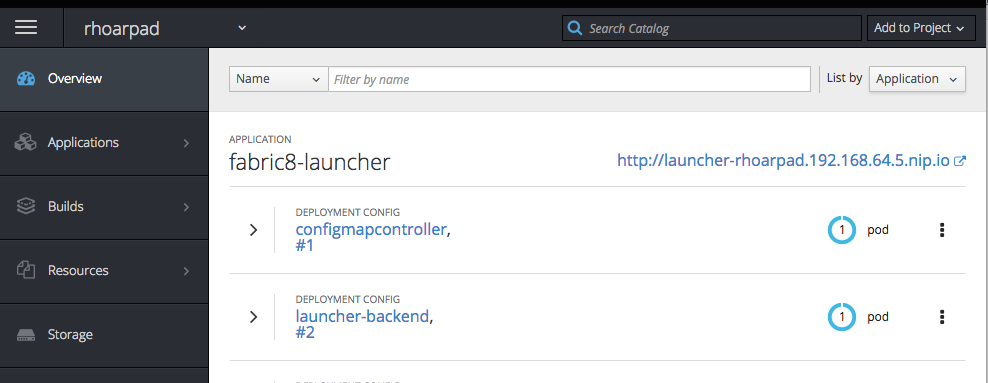  

Or retrieveing the url from `oc` command line.

```shell
oc get routes -n rhoarpad
```

Open the url in the browser.

#### Creating the project template in Lauchpad

1. Click on **Launch Your Project**.
2. Select Deployment Type: **I will build and run locally**.  
3. Select **Rest API Level 0** and hit **Continue**.  

    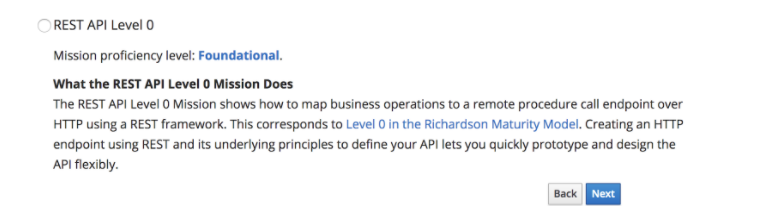

4. Select the **Spring Boot** runtime and hit **Next**.
5. Add properties.
6. Update Artifact ID to `springboot-adj`.

    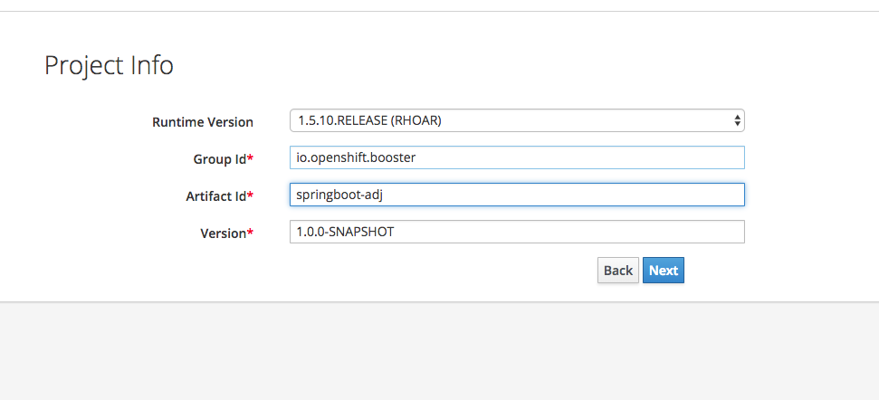  

    > NOTE: Make sure you keep the same application names as we will be referring them as service names later in this lab.

7. Summary Screen - Please review carefully and hit **Download as zip**.  
8. Copy the zip file into any directory you choose (we will be using as a workspace) and unzip it.

#### Importing the Adjective Project into JBoss Developer Studio  

We will import the project template you just created into the IDE and deploy it on OpenShift.

> NOTE - Please ensure you are logged into OpenShift in the `springbootapps` project.

1. Create a new project called `springbootapps`.
```
oc new-project springbootapps
```
2. Make sure your are using the right project.
```
oc project springbootapps
```
3. Run the following command to unzip the downloaded project bundle, or you can just double click.
```shell
unzip springboot-adj.zip
```
4. Open JBoss Developer Studio (Redsphere Icon).

5. Choose the following menu options to import the project
**File** -> **Import** -> **Maven** -> **Existing Maven Projects**, **Browse** to the location where the unzipped project is and select the project. (Most likely you may have unzipped it in the **Downloads** folder!!).

Next step is to update the **Run Configurations** for your maven build. We will add the fabric8 plugin command to deploy into our OpenShift cluster.

   The `fabric8-maven-plugin` is a Maven plugin that accelerates development by allowing easy and quick deployment of Java applications to OpenShift. This plugin reduces the required steps by building the application, creating a docker image and deploying it to OpenShift in a single command, which is especially useful in the development stage, where multiple retries often accompany each step.

3. Right click in the project name and select **Run As -> Run Configurations...**

    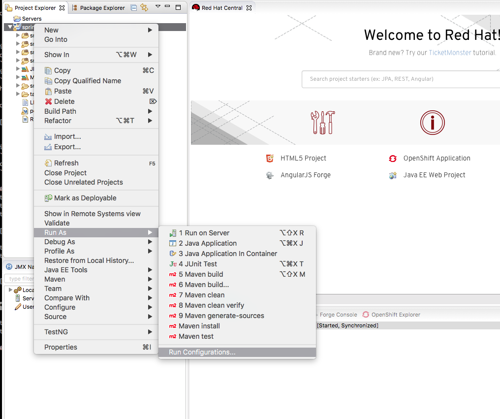

4. Select **Maven Build** in the left menu list.
5. In **Goals** type: `clean fabric8:deploy -Popenshift` and hit **Run**

    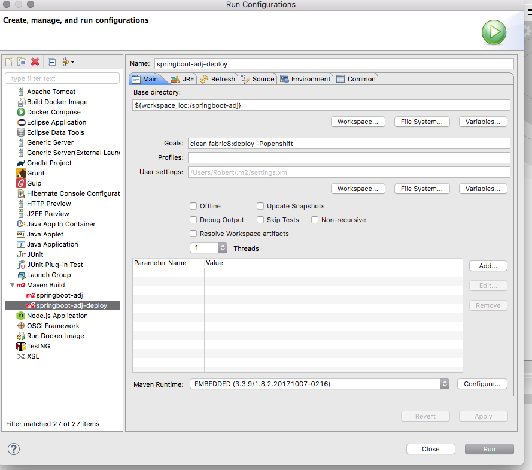  

6. You should see a successful deployment at the end of logs.  

    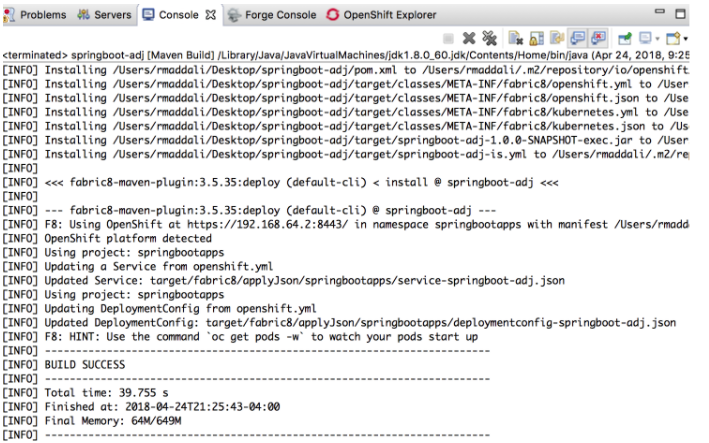

#### Validating the Deployment

Log into your OpenShift instance and get the url for the service we deployed.

1. Login to OpenShift Console with credentials `admin/admin`.
2. Click on Project `springbootapps`.
3. You should notice that there is a pod running (the blue circle).

    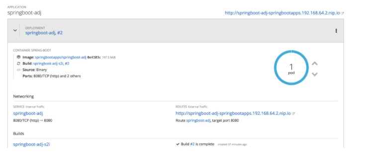

4. Click in the route URL on the right corner. It sould look similar to this http://springboot-adj-springbootapps.192.168.64.2.nip.io/  

5. You should see the service test page.

    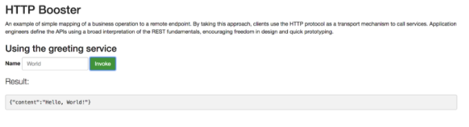

###  Create Adjective Rest Service

Now that we got an understanding on how build and deploy process works, lets create a new service for returning list of adjectives.

#### Create the Adjective Model Class  

Inside JBoss Developer Studio follow:

1. **File** -> **New** -> **Class**.  
2. Enter package name - `io.openshift.booster.adjective.model`  
3. Enter class name: `Adjective`  

    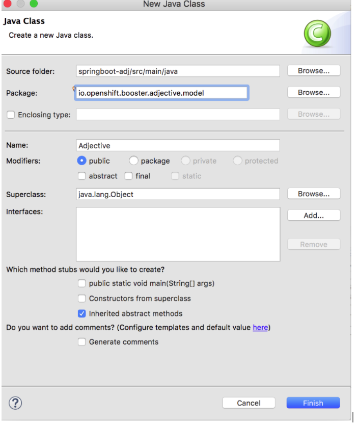

4. Replace the content by the following:

```java
package io.openshift.booster.adjective.model;

import java.util.Objects;

public class Adjective {


	private String adjective;

    public Adjective() {
    }

    public Adjective(String adjective) {
        this.adjective = adjective;
    }

    public String getAdjective() {
        return adjective;
    }

    public Adjective adjective(String adjective) {
        this.adjective = adjective;
        return this;
    }

    @Override
    public boolean equals(Object o) {
        if (this == o) return true;
        if (o == null || getClass() != o.getClass()) return false;
        Adjective adjective1 = (Adjective) o;
        return Objects.equals(adjective, adjective1.adjective);
    }

    @Override
    public int hashCode() {
        return Objects.hash(adjective);
    }

    @Override
    public String toString() {
        final StringBuffer sb = new StringBuffer("Adjective{");
        sb.append("adjective='").append(adjective).append('\'');
        sb.append('}');
        return sb.toString();
    }

}
```    


#### Create the Adjective resource

Inside JBoss Developer Studio follow:

1. **File** -> **New** -> **Class**.  
2. Enter package name - `io.openshift.booster.adjective.model`  
3. Enter class name: `AdjectiveServiceController`

   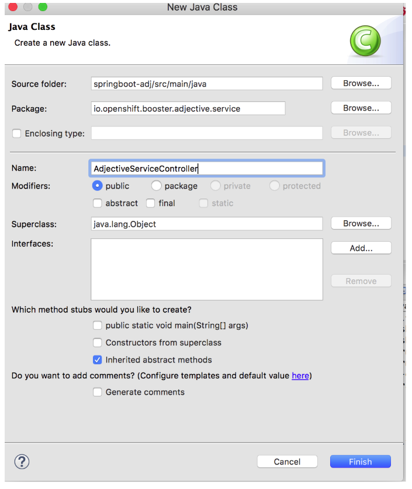

4. Replace the content by the following:

```java
package io.openshift.booster.adjective.service;

import java.io.BufferedReader;
import java.io.InputStream;
import java.io.InputStreamReader;
import java.util.ArrayList;
import java.util.List;
import java.util.Random;

import javax.annotation.PostConstruct;

import org.springframework.web.bind.annotation.RequestMapping;
import org.springframework.web.bind.annotation.RestController;

import io.openshift.booster.adjective.model.Adjective;

@RestController
public class AdjectiveServiceController {

    private List<Adjective> adjectives = new ArrayList<>();

    @RequestMapping("/api/adjective")
    public Adjective getAdjective() {

        return adjectives.get(new Random().nextInt(adjectives.size()));
    }


    @PostConstruct
    public void init() {


    	try {
            InputStream is = this.getClass().getClassLoader().getResourceAsStream("classpath:"+"adjectives.txt");
            if (is != null) {
                BufferedReader reader = new BufferedReader(new InputStreamReader(is));
                reader.lines()
                        .forEach(adj -> adjectives.add(new Adjective(adj.trim())));
            }
        } catch (Exception e) {
            e.printStackTrace();
        }

    }
}
```

#### Create the adjective text file


1. Create a new file **File**->**New**->**File** under `src/main/resources`.

2. Name that file: `adjectives.txt`.

3. Once the file is created, paste the following content:

```
artless
base-court
bawdy
bat-fowling
beslubbering
beef-witted
bootless
beetle-headed
churlish
boil-brained
cockered
clapper-clawed
clouted
clay-brained
craven
common-kissing
currish
crook-pated
dankish
dismal-dreaming
dissembling
dizzy-eyed
droning
doghearted
errant
dread-bolted
fawning
earth-vexing
fobbing
elf-skinned
froward
fat-kidneyed
frothy
fen-sucked
gleeking
flap-mouthed
goatish
fly-bitten
gorbellied
folly-fallen
impertinent
fool-born
infectious
full-gorged
jarring
guts-griping
loggerheaded
half-faced
lumpish
hasty-witted
mammering
hedge-born
mangled
hell-hated
mewling
idle-headed
paunchy
ill-breeding
pribbling
ill-nurtured
puking
knotty-pated
puny
milk-livered
qualling
motley-minded
rank
onion-eyed
reeky
plume-plucked
roguish
pottle-deep
ruttish
pox-marked
saucy
reeling-ripe
spleeny
rough-hewn
spongy
rude-growing
surly
rump-fed
tottering
shard-borne
unmuzzled
sheep-biting
vain
spur-galled
venomed
swag-bellied
villainous
tardy-gaited
warped
tickle-brained
wayward
toad-spotted
weedy
unchin-snouted
yeasty
weather-bitten
cullionly
whoreson
fusty
malmsey-nosed
caluminous
rampallian
wimpled
lily-livered
burly-boned
scurvy-valiant
misbegotten
brazen-faced
odiferous
unwash'd
poisonous
bunch-back'd
fishified
leaden-footed
wart-necked
muddy-mettled
pigeon-liver'd
scale-sided
```

#### Deploy the service to OpenShift

Inside the JBoss Developer Studio execute the following:

1. **Right Click** -> **Run As** -> **Run Configuration**.  
2. Select Maven profile **springboot-adj** and hit **Run**.

    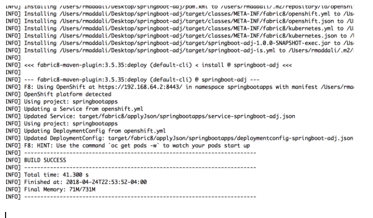   

3. Open the OpenShift Web Console and *copy* the url for your `springboot-adj` service. It should looks like this: http://springboot-adj-springbootapps.192.168.64.2.nip.io

4. Open your browser and add to the end of the url `/api/adjective` so the full url will be similar to http://springboot-adj-springbootapps.192.168.64.2.nip.io/api/adjective

5. You will see the `json` response payload like this:

```JSON
{"adjective":"fishified"}
```

#### Creating the Noun project template in LaunchPad

Now we will create the Noun service but now using WildFly Swarm runtime.
1. Open LaunchPad (you can get the url by opening the **rhoarpad** project).
2. Click on **Launch Your Project**.
3. Select Deployment Type: **I will build and run locally**.  
4. Select **Rest API Level 0** and hit **Continue**.  

    

5. Select the **WildFly Swarm** runtime and hit **Next**.

    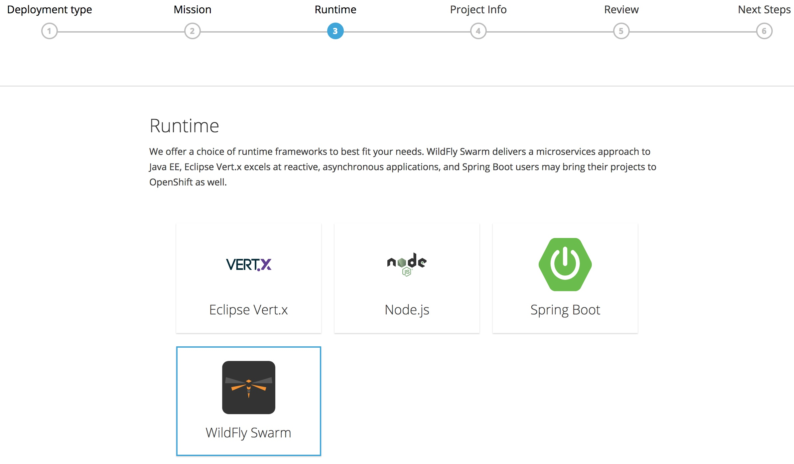

6. Add properties.
7. Update Artifact ID to `wildfly-noun`.
8. Select Runtime Version: **2018.5.0(Community)**.

    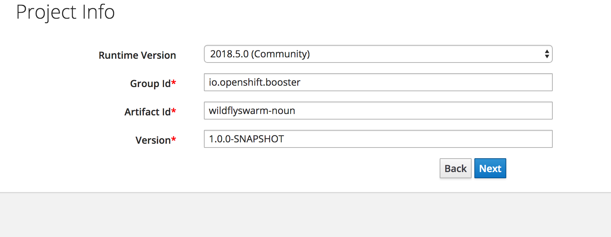

    > NOTE: Make sure you keep the same application names as we will be referring them as service names later in this lab.

9. Summary Screen - Please review carefully and hit **Download as zip**.

    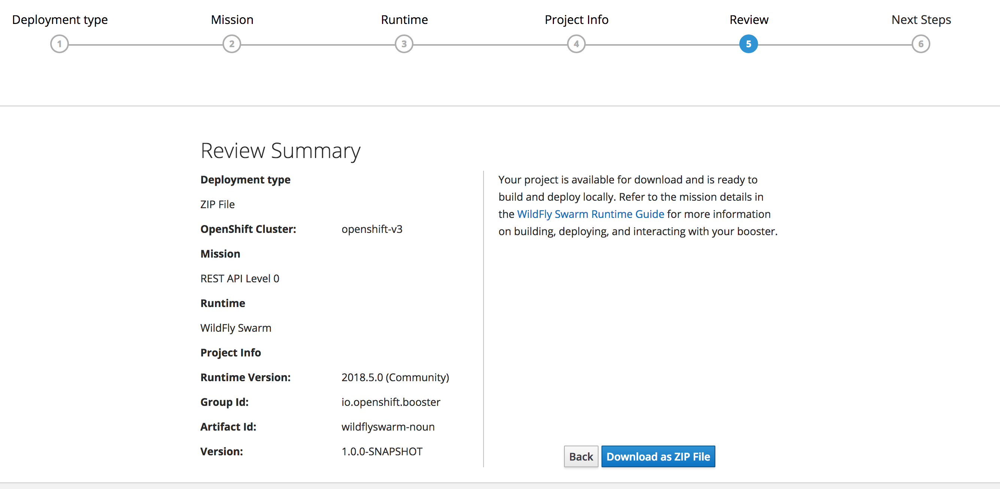

10. Copy the zip file into any directory you choose (we will be using as a workspace) and unzip it.

#### Importing the Noun Project into JBoss Developer Studio  

We will import the project template you just created into the IDE and deploy it on OpenShift.

> NOTE - Please ensure you are logged into OpenShift in the `wildflyswarmapps` project.

1. Create a new project called `wildflyswarmapps`.
```
oc new-project wildflyswarmapps
```
2. Make sure your are using the right project.
```
oc project wildflyswarmapps
```
3. Run the following command to unzip the downloaded project bundle, or you can just double click.
```shell
unzip wildflyswarm-noun.zip
```
4. Open JBoss Developer Studio (Redsphere Icon).

5. Choose the following menu options to import the project
**File** -> **Import** -> **Maven** -> **Existing Maven Projects**, **Browse** to the location where the unzipped project is and select the project. (Most likely you may have unzipped it in the **Downloads** folder!!).

6. Add the following dependency in the `pom.xml`.
```xml
<dependency>
   <groupId>org.wildfly.swarm</groupId>
   <artifactId>cdi</artifactId>
</dependency>
```
    Next step is to update the **Run Configurations** for your maven build. We will add the fabric8 plugin command to deploy into our OpenShift cluster.

   The `fabric8-maven-plugin` is a Maven plugin that accelerates development by allowing easy and quick deployment of Java applications to OpenShift. This plugin reduces the required steps by building the application, creating a docker image and deploying it to OpenShift in a single command, which is especially useful in the development stage, where multiple retries often accompany each step.

7. Right click in the project name and select **Run As -> Run Configurations...**

    

8. Select **Maven Build** in the left menu list.
9. In **Goals** type: `clean fabric8:deploy -Popenshift` and hit **Run**

      

10. You should see a successful deployment at the end of logs.  

    

###  Create Noun Rest Service

Now that we got an understanding on how build and deploy process works, lets create a new service for returning list of nouns.

#### Create the Noun Model Class  

Inside JBoss Developer Studio follow:

1. **File** -> **New** -> **Class**.  
2. Enter package name - `io.openshift.booster.noun.model`  
3. Enter class name: `Noun`  

    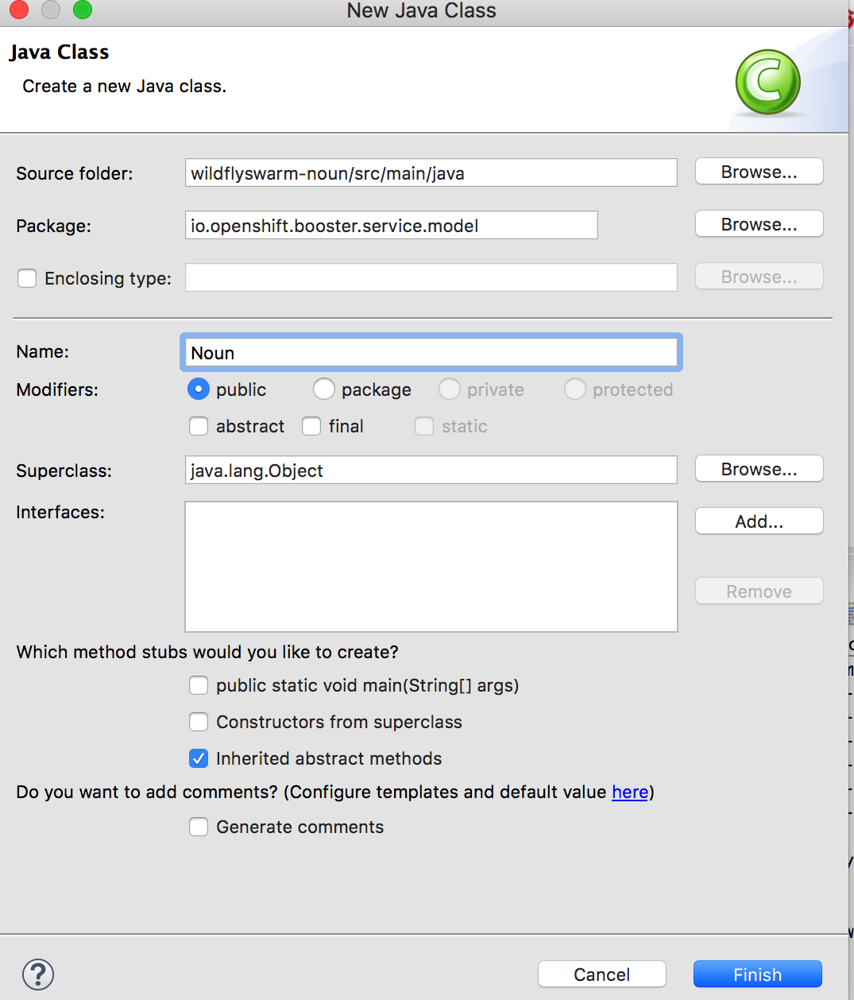

4. Replace the content by the following:

  ```java
  package io.openshift.booster.service.model;

  import java.util.Objects;

  public class Noun {

      private String noun;

      public Noun() {
      }

      public Noun(String noun) {
          this.noun = noun;
      }

      public String getNoun() {
          return noun;
      }

      public Noun noun(String noun) {
          this.noun = noun;
          return this;
      }

      @Override
      public boolean equals(Object o) {
          if (this == o) return true;
          if (o == null || getClass() != o.getClass()) return false;
          Noun noun1 = (Noun) o;
          return Objects.equals(noun, noun1.noun);
      }

      @Override
      public int hashCode() {
          return Objects.hash(noun);
      }

      @Override
      public String toString() {
          final StringBuffer sb = new StringBuffer("Noun{");
          sb.append("noun='").append(noun).append('\'');
          sb.append('}');
          return sb.toString();
      }
  }
  ```

5. Create the `NounResource` class in the package `io.openshift.booster.noun.service`.

    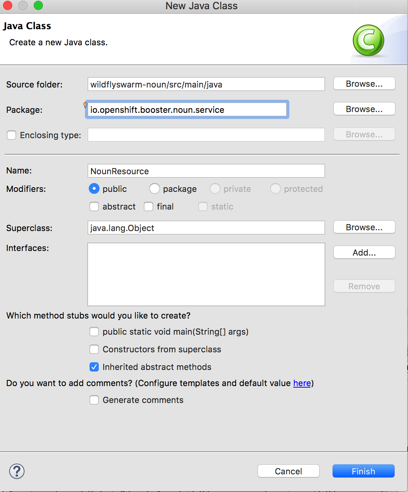

6. Replace the content by the following:

  ```java
  package io.openshift.booster.noun.service;

  import java.io.BufferedReader;
  import java.io.InputStream;
  import java.io.InputStreamReader;
  import java.util.ArrayList;
  import java.util.List;
  import java.util.Random;

  import javax.annotation.PostConstruct;
  import javax.enterprise.context.ApplicationScoped;
  import javax.ws.rs.Consumes;
  import javax.ws.rs.DELETE;
  import javax.ws.rs.GET;
  import javax.ws.rs.POST;
  import javax.ws.rs.Path;
  import javax.ws.rs.PathParam;
  import javax.ws.rs.Produces;
  import javax.ws.rs.core.MediaType;
  import javax.ws.rs.core.Response;

  import io.openshift.booster.service.model.Noun;

  @Path("/")
  @ApplicationScoped

  public class NounResource {

      private List<Noun> nouns = new ArrayList<>();

      @PostConstruct
      public void loadData() {
          try {
              InputStream is = this.getClass().getClassLoader().getResourceAsStream("noun.txt");
              if (is != null) {
                  BufferedReader reader = new BufferedReader(new InputStreamReader(is));
                  reader.lines()
                          .forEach(noun -> nouns.add(new Noun(noun.trim())));
              }
          } catch (Exception e) {
              e.printStackTrace();
          }
      }

      @GET
      @Produces(MediaType.APPLICATION_JSON)
      @Path("/noun")
      public Noun getNoun() {
          return nouns.get(new Random().nextInt(nouns.size()));
      }

      @POST
      @Consumes(MediaType.APPLICATION_JSON)
      @Produces(MediaType.APPLICATION_JSON)
      public Response addNoun(Noun noun) {
          if (nouns.contains(noun)) {
              return Response
                      .status(Response.Status.CONFLICT)
                      .build();
          }

          nouns.add(noun);

          return Response
                  .status(Response.Status.CREATED)
                  .entity(noun)
                  .build();
      }

      @DELETE
      @Path("/{noun}")
      public Response deleteNoun(@PathParam("noun") String nounName) {
          Noun deletingNoun = new Noun(nounName);

          if (!nouns.contains(deletingNoun)) {
              return Response
                      .status(Response.Status.NOT_FOUND)
                      .build();
          }

          nouns.remove(deletingNoun);

          return Response
                  .noContent()
                  .build();
      }
  }
  ```

7. Create the `noun.txt` file under the `src/main/resources`.

8. Add the following content to `noun.txt`:

  ```
  apple-john
  baggage
  barnacle
  bladder
  boar-pig
  bugbear
  bum-bailey
  canker-blossom
  clack-dish
  clotpole
  coxcomb
  codpiece
  death-token
  dewberry
  flap-dragon
  flax-wench
  flirt-gill
  foot-licker
  fustilarian
  giglet
  gudgeon
  haggard
  harpy
  hedge-pig
  horn-beast
  hugger-mugger
  joithead
  lewdster
  lout
  maggot-pie
  malt-worm
  mammet
  measle
  minnow
  miscreant
  moldwarp
  mumble-news
  nut-hook
  pigeon-egg
  pignut
  puttock
  pumpion
  ratsbane
  scut
  skainsmate
  strumpet
  varlot
  vassal
  whey-face
  wagtail
  knave
  blind-worm
  popinjay
  scullian
  jolt-head
  malcontent
  devil-monk
  toad
  rascal
  Basket-Cockle
  rapscallion
  ```

#### Deploy the service to OpenShift

Inside the JBoss Developer Studio execute the following:

1. **Right Click** -> **Run As** -> **Run Configuration**.  
2. Select Maven profile **wildflyswarm-noun** and hit **Run**.

    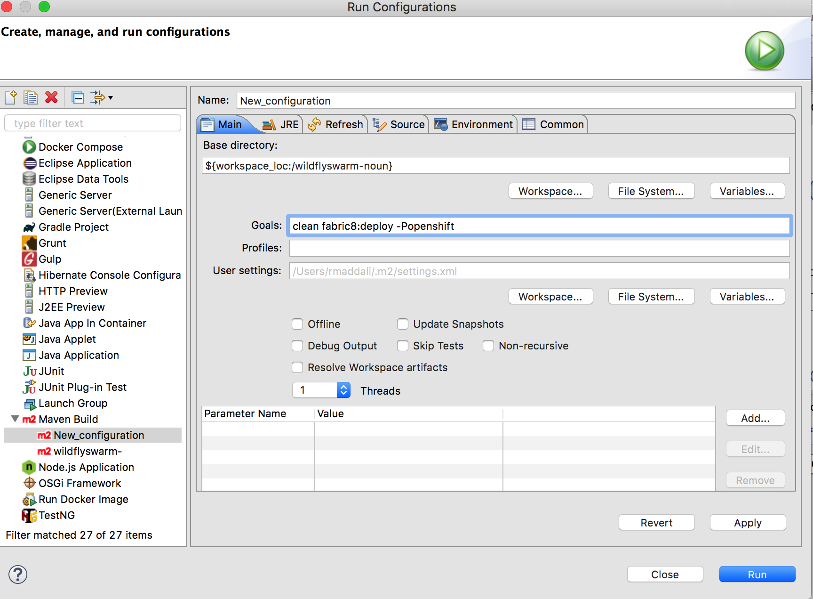  

3. You will see the build finishing successfully.

    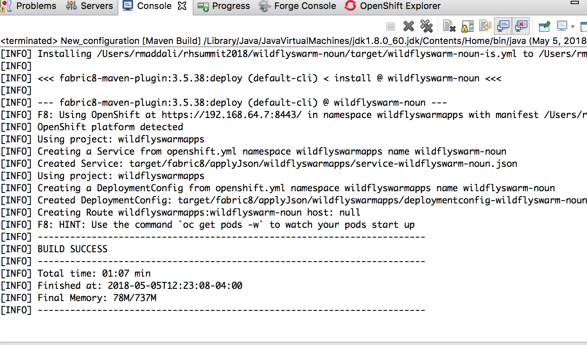

4. Open the OpenShift Web Console and go to your project `wildflyswarmapps` and *copy* the url for your `wildflyswarm-noun` service. It should looks like this: http://wildflyswarm-noun-wildflyswarmapps.192.168.64.2.nip.io

5. Open your browser and add to the end of the url `/api/noun` so the full url will be similar to http://wildflyswarm-noun-wildflyswarmapps.192.168.64.2.nip.io/api/noun

6. You will see the `json` response payload like this:

```JSON
{"noun":"coxcomb"}
```

#### Creating the Vert.x Gateway project template in LaunchPad

Now we will create the Gateway service using Vert.x runtime.

1. Open LaunchPad (you can get the url by opening the **rhoarpad** project).
2. Click on **Launch Your Project**.
3. Select Deployment Type: **I will build and run locally**.  
4. Select **Rest API Level 0** and hit **Continue**.  

    

5. Select the **Eclipse Vert.x** runtime and hit **Next**.

    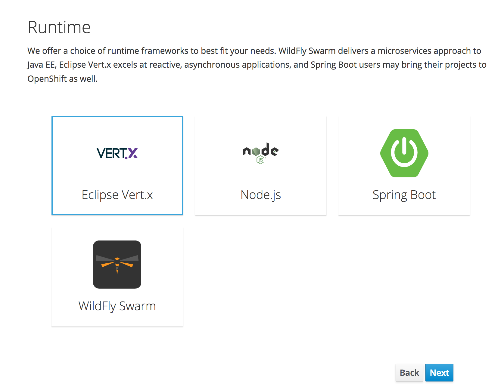

6. Add properties.
7. Update Artifact ID to `vertx-gateway`.
8. Select Runtime Version: **3.5.0.Final (Community)**.

    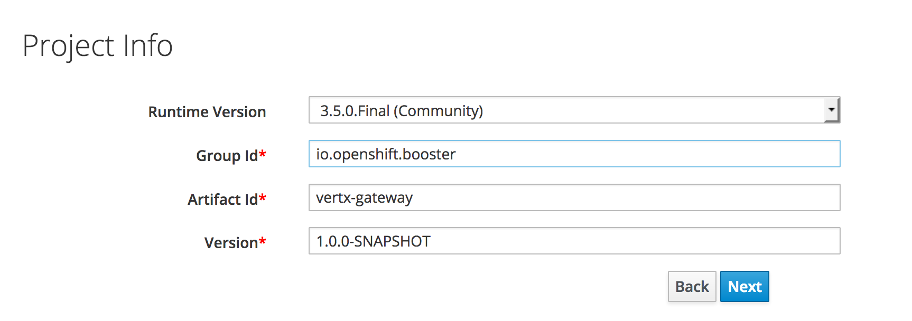

    > NOTE: Make sure you keep the same application names as we will be referring them as service names later in this lab.

9. Summary Screen - Please review carefully and hit **Download as ZIP File**.

    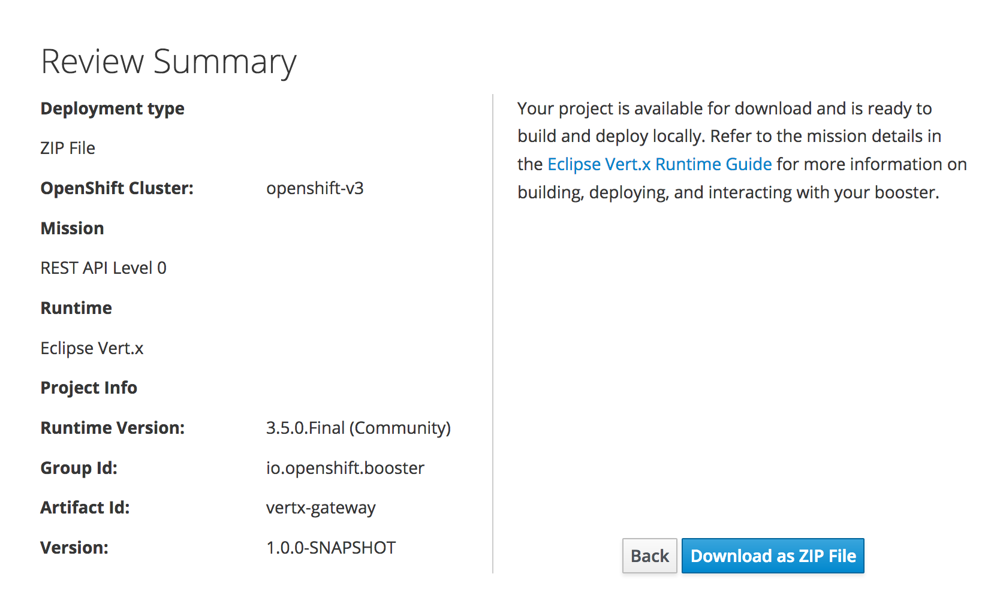

10. Copy the zip file into any directory you choose (we will be using as a workspace) and unzip it.

#### Importing the Gateway Project into JBoss Developer Studio  

We will import the project template you just created into the IDE and deploy it on OpenShift.

> NOTE - Please ensure you are logged into OpenShift in the `vertxapps` project.

1. Create a new project called `vertxapps`.
```
oc new-project vertxapps
```
2. Make sure your are using the right project.
```
oc project vertxapps
```
3. Run the following command to unzip the downloaded project bundle, or you can just double click.
```shell
unzip vertx-gateway.zip
```
4. Open JBoss Developer Studio (Redsphere Icon).

5. Choose the following menu options to import the project
**File** -> **Import** -> **Maven** -> **Existing Maven Projects**, **Browse** to the location where the unzipped project is and select the project. (Most likely you may have unzipped it in the **Downloads** folder!!).

6. Add the following dependencies in the `pom.xml`.
```xml
<dependency>
  <groupId>io.vertx</groupId>
  <artifactId>vertx-circuit-breaker</artifactId>
</dependency>
<dependency>
  <groupId>io.vertx</groupId>
  <artifactId>vertx-rx-java</artifactId>
</dependency>
```
7. Remove the `<scope>test</scope>` tag from the `vertx-web-client` dependency in the `pom.xml`.

    Next step is to update the **Run Configurations** for your maven build. We will add the fabric8 plugin command to deploy into our OpenShift cluster.

   The `fabric8-maven-plugin` is a Maven plugin that accelerates development by allowing easy and quick deployment of Java applications to OpenShift. This plugin reduces the required steps by building the application, creating a docker image and deploying it to OpenShift in a single command, which is especially useful in the development stage, where multiple retries often accompany each step.

8. Right click in the project name and select **Run As -> Run Configurations...**

    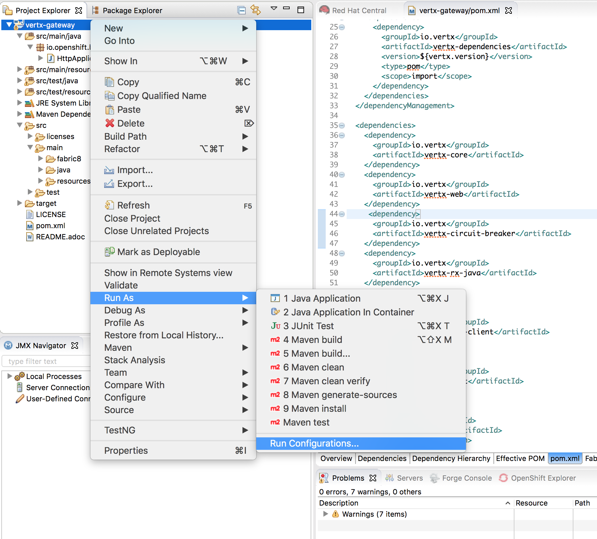

9. Select **Maven Build** in the left menu list.
10. Make sure the **Base directory** is: `${workspace_loc:/vertx-gateway}`.
11. In **Goals** type: `clean fabric8:deploy -Popenshift` and hit **Run**

    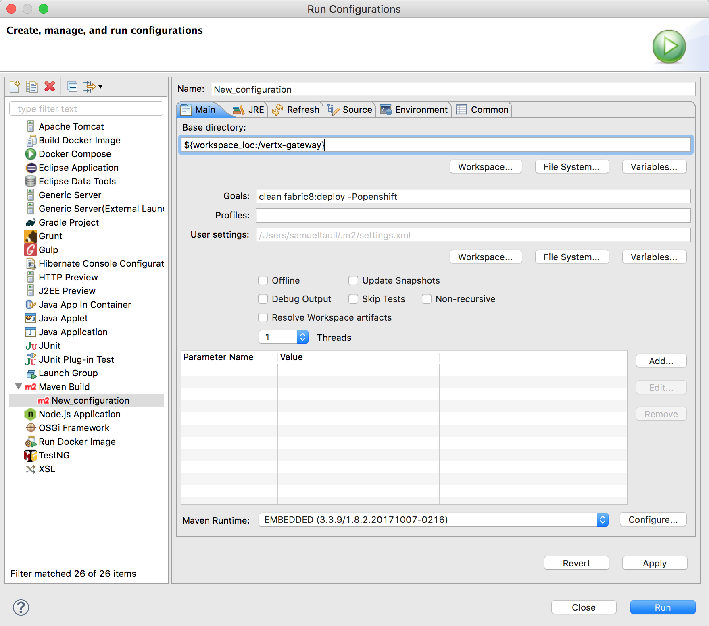  

12. You should see a successful deployment at the end of logs.  

    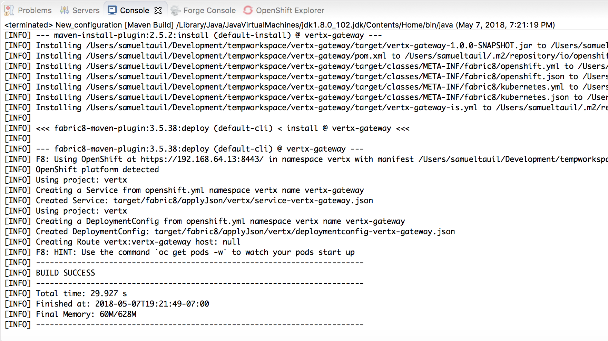

###  Create the Gateway Service

Now that we got an understanding on how build and deploy process works, lets create a new service for returning the results from calls to adjective service and noun service.

#### Create the Gateway Service Verticle  

Inside JBoss Developer Studio follow:

1. **File** -> **New** -> **Class**.  
2. Enter package name - `io.openshift.booster.gateway.service`  
3. Enter class name: `GatewayServiceVerticle`  

    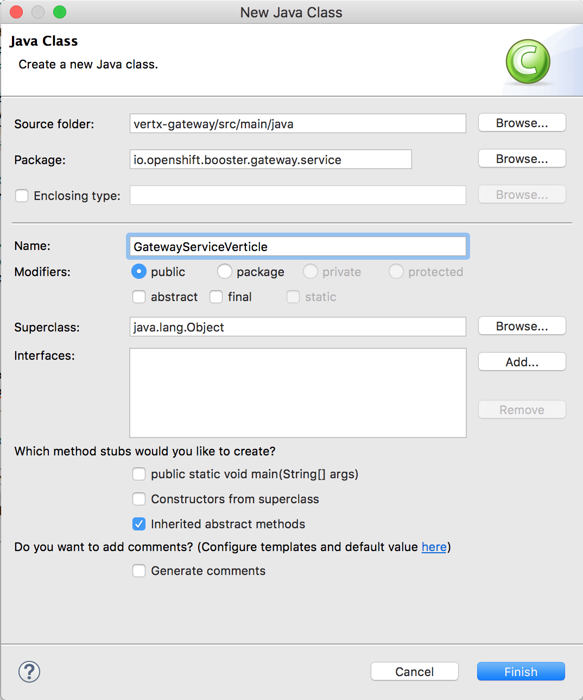

4. Replace the content by the following:

```java
  package io.openshift.booster.gateway.service;

  import static io.netty.handler.codec.http.HttpHeaderValues.APPLICATION_JSON;
  import static io.vertx.core.http.HttpHeaders.CONTENT_TYPE;

  import java.util.HashMap;
  import java.util.Map;

  import io.vertx.circuitbreaker.CircuitBreakerOptions;
  import io.vertx.core.Handler;
  import io.vertx.core.json.JsonObject;
  import io.vertx.ext.web.client.WebClientOptions;
  import io.vertx.ext.web.handler.sockjs.BridgeOptions;
  import io.vertx.ext.web.handler.sockjs.PermittedOptions;
  import io.vertx.rxjava.circuitbreaker.CircuitBreaker;
  import io.vertx.rxjava.circuitbreaker.HystrixMetricHandler;
  import io.vertx.rxjava.core.AbstractVerticle;
  import io.vertx.rxjava.ext.web.Router;
  import io.vertx.rxjava.ext.web.RoutingContext;
  import io.vertx.rxjava.ext.web.client.HttpResponse;
  import io.vertx.rxjava.ext.web.client.WebClient;
  import io.vertx.rxjava.ext.web.handler.StaticHandler;
  import io.vertx.rxjava.ext.web.handler.sockjs.SockJSHandler;
  import rx.Single;

  public class GatewayServiceVerticle extends AbstractVerticle {

      protected static final String template = "Congrats, %s %s!";
      private Map<String, String> response;

      private CircuitBreaker circuit;
      private WebClient clientSpringboot;
      private WebClient clientSwarm;

      @Override
      public void start() throws Exception {
          circuit = CircuitBreaker.create("circuit-breaker", vertx,
              new CircuitBreakerOptions()
                  .setFallbackOnFailure(true)
                  .setMaxFailures(3)
                  .setResetTimeout(5000)
                  .setNotificationAddress("circuit-breaker")
                  .setTimeout(1000)
          );

          clientSpringboot = WebClient.create(vertx, new WebClientOptions()
              .setDefaultHost("springboot-adj.springbootapps.svc")
              .setDefaultPort(8080));

          clientSwarm = WebClient.create(vertx, new WebClientOptions()
                  .setDefaultHost("wildflyswarm-noun.wildflyswarmapps.svc")
                  .setDefaultPort(8080));

          response = new HashMap<String, String>();

          Router router = Router.router(vertx);

          router.get("/health").handler(rc -> rc.response().end("OK"));
          router.get("/eventbus/*").handler(getSockJsHandler());
          // The address is the circuit breaker notification address configured above.
          router.get("/metrics").handler(HystrixMetricHandler.create(vertx, "circuit-breaker"));


          router.get("/api/gateway").handler(this::dispatch);
          router.get("/api/cb-state").handler(
              rc -> rc.response()
                  .putHeader(CONTENT_TYPE.toString(), APPLICATION_JSON.toString())
                  .end(new JsonObject().put("state", circuit.state()).encodePrettily()));
          router.get("/*").handler(StaticHandler.create());

          vertx.createHttpServer()
              .requestHandler(router::accept)
              .listen(8080);
      }


      private void dispatch(RoutingContext rc) {

      	Single<String> adjectiveCommandWithFallback = circuit.rxExecuteCommandWithFallback(
              future ->
                  clientSpringboot.get("/api/adjective").rxSend()
                      .doOnEach(r -> System.out.println(r.getValue().bodyAsString()))
                      .map(HttpResponse::bodyAsJsonObject)
                      .map(json -> json.getString("adjective"))                    
                      .subscribe(
                          future::complete,
                          future::fail
                      ),
              error -> {
                  System.out.println("Fallback called for " + error.getMessage());
                  error.printStackTrace();
                  return "fallback-adjective";
              }
          );

          Single<String> nounCommandWithFallback = circuit.rxExecuteCommandWithFallback(
                  future ->
                  clientSwarm.get("/api/noun").rxSend()
                          .doOnEach(r -> System.out.println(r.getValue().bodyAsString()))
                          .map(HttpResponse::bodyAsJsonObject)
                          .map(json -> json.getString("noun"))                    
                          .subscribe(
                              future::complete,
                              future::fail
                          ),
                  error -> {
                      System.out.println("Fallback called for " + error.getMessage());
                      error.printStackTrace();
                      return "fallback-noun";
                  }
              );

          adjectiveCommandWithFallback.subscribe(
          		adjective -> {
                      response.put("adjective", adjective);
                  }
              );

          nounCommandWithFallback.subscribe(
          		noun -> {
          			response.put("noun", noun);
                  }
              );

          JsonObject jsonResponse = new JsonObject()
                  .put("content", String.format(template, response.get("adjective"), response.get("noun")));
              rc.response()
                  .putHeader(CONTENT_TYPE.toString(), APPLICATION_JSON.toString())
                  .end(jsonResponse.encode());
      }

      private Handler<RoutingContext> getSockJsHandler() {
          SockJSHandler sockJSHandler = SockJSHandler.create(vertx);
          BridgeOptions options = new BridgeOptions();
          options.addInboundPermitted(
              new PermittedOptions().setAddress("circuit-breaker"));
          options.addOutboundPermitted(
              new PermittedOptions().setAddress("circuit-breaker"));
          return sockJSHandler.bridge(options);
      }
  }
```
#### Delete the sample class in the project
Using the LaunchPad it generates a couple of classes that might conflict with the Verticle we just created.

1. Delete the `HttpApplication.java` under the package `io.openshift.booster` in `src/main/java`.
2. Delete the classes `HttpApplicationTest.java` and `OpenShiftIT.java` under the package `io.openshift.booster` in `src/test/java`.


#### Deploy the service to OpenShift

Inside the JBoss Developer Studio execute the following:

1. **Right Click** -> **Run As** -> **Run Configuration**.  
2. Select Maven profile **vertx-gateway** and hit **Run**.

    

3. You will see the build finishing successfully.

    

4. Open the OpenShift Web Console and go to your project `vertxapps` and *copy* the url for your `vertx-gateway` service. It should looks like this: http://vertx-gateway-vertxapps.192.168.64.2.nip.io

5. Open your browser and add to the end of the url `/api/gateway` so the full url will be similar to http://vertx-gateway-vertxapps.192.168.64.2.nip.io/api/gateway

6. You will see the `json` response payload like this:

```JSON
{"content":"Congrats, infectious devil-monk!"}
```

#### Testing the Circuit Breaker

Circuit breaker is a design pattern used in modern software development. It is used to detect failures and encapsulates the logic of preventing a failure from constantly recurring, during maintenance, temporary external system failure or unexpected system difficulties.

1. Open your **springbootapps** project in the OpenShift Web Console and scale down the appplication to 0 pods by using the arrows close to the blue circle.

    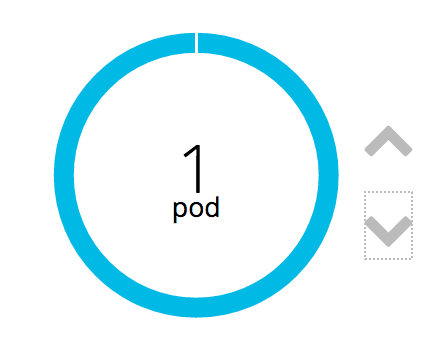


2. After scaling down you will notice that now we have zero pods running.

    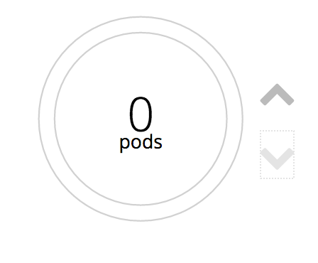

3. Now test the vertx service again by opening the url in your browser add to the end of the url `/api/gateway` so the full url will be similar to http://vertx-gateway-vertxapps.192.168.64.2.nip.io/api/gateway

4. You will see the `json` response payload like this:

```JSON
{"content":"Congrats, fallback-adjective devil-monk!"}
```

5. Notice the `fallback-adjective` part of the payload that was added in order to avoid a failure created by the previous step.
